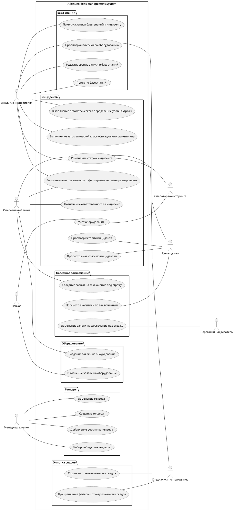

# Use case diagram

```plantuml
@startuml
left to right direction

actor "Оператор мониторинга" as Operator
actor "Аналитик-ксенобиолог" as Analyst
actor "Оперативный агент" as Agent
actor "Завхоз" as Storekeeper
actor "Менеджер закупок" as Procurement
actor "Специалист по прикрытию" as Cleaner
actor "Тюремный надзиратель" as Guard
actor "Руководство" as Management

rectangle "Alien Incident Management System" {

package "Инциденты" {

(Создание инцидента) as UC33
(Изменение статуса инцидента) as UC12
(Просмотр истории инцидента) as UC13
(Назначение ответственного за инцидент) as UC14

(Просмотр аналитики по инцидентам) as UC15

(Выполнение автоматической классификация инопланетянина) as UC16
(Выполнение автоматического определение уровня угрозы) as UC17
(Выполнение автоматического формирование плана реагирования) as UC18

}

package "База знаний" {

(Создание записи в базе знаний) as UC34
(Редактирование записи в базе знаний) as UC22
(Поиск по базе знаний) as UC23
(Привязка записи базы знаний к инциденту) as UC24

}

package "Оборудование" {

(Создание заявки на оборудование) as UC31
(Изменение заявки на оборудование) as UC32
(Учет оборудования) as UC33

(Просмотр аналитики по оборудованию) as UC34

}

package "Тендеры" {

(Создание тендера) as UC41
(Добавление участника тендера) as UC42
(Выбор победителя тендера) as UC43
(Изменение тендера) as UC44

}

package "Тюремное заключение" {

(Создание заявки на заключение под стражу) as UC51
(Изменение заявки на заключение под стражу) as UC52

(Просмотр аналитики по заключенным) as UC53

}

package "Очистка следов" {

(Создание отчета по очистке следов) as UC61
(Прикрепление файлов к отчету по очистке следов) as UC62

}

}

UC33 -- Operator
UC12 -- Operator

Analyst -- UC12
Analyst -- UC34
Analyst -- UC22
Analyst -- UC23
Analyst -- UC24
Analyst -- UC16
Analyst -- UC17
Analyst -- UC18

Agent -- UC12
Agent -- UC14
Agent -- UC31
Agent -- UC51
Agent -- UC18

Storekeeper -- UC32
Storekeeper -- UC33

Procurement -- UC41
Procurement -- UC42
Procurement -- UC43
Procurement -- UC44

UC52 --- Guard

UC12 -- Cleaner
UC61 -- Cleaner
UC62 -- Cleaner

UC13 -- Management
UC15 -- Management
UC34 -- Management
UC53 -- Management

@enduml
```
