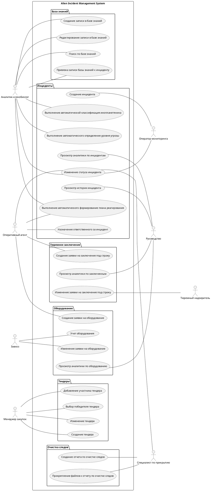

# Use case diagram

```plantuml
@startuml
left to right direction

actor "Оператор мониторинга" as Operator
actor "Аналитик-ксенобиолог" as Analyst
actor "Оперативный агент" as Agent
actor "Завхоз" as Storekeeper
actor "Менеджер закупок" as Procurement
actor "Специалист по прикрытию" as Cleaner
actor "Тюремный надзиратель" as Guard
actor "Руководство" as Management

rectangle "Alien Incident Management System" {

package "Инциденты" {

(Создание инцидента) as UC1
(Изменение статуса инцидента) as UC2
(Назначение ответственного за инцидент) as UC3
(Просмотр истории инцидента) as UC4

(Просмотр аналитики по инцидентам) as UC20

(Выполнение автоматической классификация инопланетянина) as UC23
(Выполнение автоматического определение уровня угрозы) as UC24
(Выполнение автоматического формирование плана реагирования) as UC25

}

package "База знаний" {

(Создание записи в базе знаний) as UC5
(Редактирование записи в базе знаний) as UC6
(Поиск по базе знаний) as UC7
(Привязка записи базы знаний к инциденту) as UC8

}

package "Оборудование" {

(Создание заявки на оборудование) as UC9
(Изменение заявки на оборудование) as UC10
(Учет оборудования) as UC11

(Просмотр аналитики по оборудованию) as UC21

}

package "Тендеры" {

(Создание тендера) as UC12
(Добавление участника тендера) as UC13
(Выбор победителя тендера) as UC14
(Изменение тендера) as UC15

}

package "Тюремное заключение" {

(Создание заявки на заключение под стражу) as UC16
(Изменение заявки на заключение под стражу) as UC17

(Просмотр аналитики по заключенным) as UC22

}

package "Очистка следов" {

(Создание отчета по очистке следов) as UC18
(Прикрепление файлов к отчету по очистке следов) as UC19

}

}

UC1 -- Operator
UC2 -- Operator

Analyst -- UC2
Analyst -- UC5
Analyst -- UC6
Analyst -- UC7
Analyst -- UC8
Analyst -- UC23
Analyst -- UC24
Analyst -- UC25

Agent -- UC2
Agent -- UC3
Agent -- UC9
Agent -- UC16
Agent -- UC25

Storekeeper -- UC10
Storekeeper -- UC11

Procurement -- UC12
Procurement -- UC13
Procurement -- UC14
Procurement -- UC15

UC17 --- Guard

UC2 -- Cleaner
UC18 -- Cleaner
UC19 -- Cleaner

UC4 -- Management
UC20 -- Management
UC21 -- Management
UC22 -- Management

@enduml
```
