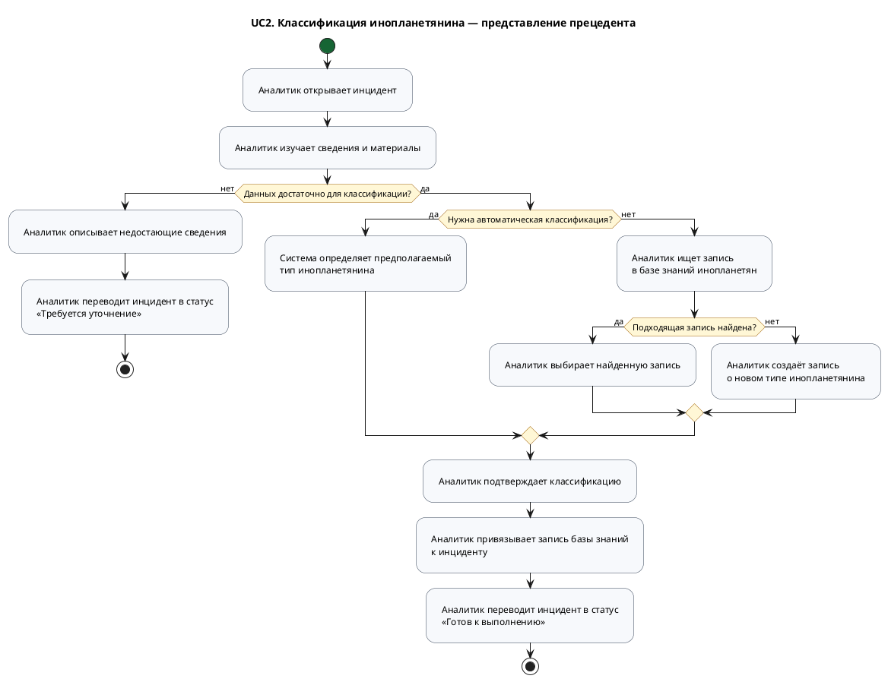

<!-- markdownlint-disable MD013 MD041 -->



```plantuml
@startuml aims_uc2_activity_logical_view
title UC2. Классификация инопланетянина — Logical View
scale max 3800 width

skinparam shadowing false
skinparam activity {
  BackgroundColor #F8FAFC
  BorderColor #334155
  DiamondBackgroundColor #FEF3C7
  DiamondBorderColor #A16207
  StartColor #166534
  EndColor #991B1B
}

<style>
activityDiagram {
  activity {
    Padding 18
  }
}
</style>

start
:[frontend]
Открыть карточку инцидента;
:[generated.api]
Контракт GET /incidents/{id};
:[controller]
Обработать получение инцидента;
:[services]
Подготовить данные для анализа;
:[repository]
Загрузить сведения и материалы инцидента;
:[frontend]
Показать сведения и материалы;

if (Данных достаточно для классификации?) then (нет)
  :[frontend]
  Указать недостающие сведения;
  :[frontend]
  Выбрать статус «Требуется уточнение»
  и добавить комментарий;
else (да)
  if (Нужна автоматическая классификация?) then (да)
    :[services]
    Определить тип инопланетянина
    по материалам инцидента;
    :[repository]
    Найти запись определённого типа;
  else (нет)
    :[frontend]
    Ввести строку поиска;
    :[generated.api]
    Контракт GET /aliens/search?q=...;
    :[controller]
    Обработать параметры поиска;
    :[services]
    Ограничить результат 20 записями;
    :[repository]
    Найти записи по названию или описанию;
    :[frontend]
    Показать найденные типы,
    описания и уровни угрозы;

    if (Подходящая запись найдена?) then (да)
      :[frontend]
      Выбрать найденный тип инопланетянина;
    else (нет)
      :[frontend]
      Указать название, описание
      и уровень угрозы нового типа;
      :[services]
      Проверить данные нового типа инопланетянина;
      :[repository]
      Создать запись нового типа инопланетянина;
    endif
  endif

  :[frontend]
  Подтвердить классификацию;
  :[generated.api]
  Контракт PUT /incidents/{id}/alien
  Данные: выбранный тип инопланетянина;
  :[controller]
  Обработать привязку инопланетянина
  к инциденту;
  :[services]
  Проверить статус «Готов к анализу»
  и существование выбранной записи;
  :[repository]
  Сохранить связь инцидента
  с типом инопланетянина;
  :[frontend]
  Выбрать статус «Готов к выполнению»;
endif

:[generated.api]
Контракт POST /incidents/{id}/status
Данные: новый статус и комментарий;
:[controller]
Обработать изменение статуса;
:[services.incident.status]
Проверить допустимость перехода
из статуса «Готов к анализу»;
:[services.incident.status.precondition]
Проверить роль аналитика-ксенобиолога,
а для статуса «Готов к выполнению» —
наличие связанного типа инопланетянина;
:[repository]
Сохранить новый статус и комментарий;
:[frontend]
Обновить карточку инцидента;
stop
@enduml
```

```plantuml
@startuml aims_uc2_activity_implementation_view
title UC2. Классификация инопланетянина — Implementation View
scale 0.75

skinparam shadowing false
skinparam defaultFontSize 11
skinparam activity {
  BackgroundColor #F8FAFC
  BorderColor #334155
  DiamondBackgroundColor #FEF3C7
  DiamondBorderColor #A16207
  StartColor #166534
  EndColor #991B1B
}

<style>
activityDiagram {
  activity {
    Padding 18
  }
}
</style>

start
:[Analyst]
Открывает инцидент в статусе READY_FOR_ANALYSIS;
:[IncidentDetailPage]
useEffect() запрашивает данные инцидента;
:[api/client.ts]
getIncident(token, incidentId);
:[IncidentsApiImpl]
getIncident(id);
:[IncidentServiceImpl]
getById(id);
:[IncidentRepository]
findById(id);

if (Инцидент найден?) then (да)
  :[IncidentMapper]
  toResponse(entity);
  :[IncidentDetailPage]
  setIncident(data);
else (нет)
  :[Errors]
  incidentNotFound();
  :[IncidentDetailPage]
  setError(message);
  stop
endif

if (Сведений достаточно для классификации?) then (да)
  :[IncidentDetailPage]
  setAlienDrawerOpen(true);
  :[AlienPickerDrawer]
  setSearchQuery(input);
  :[AlienPickerDrawer]
  useEffect() проверяет два символа
  и применяет задержку 300 мс;
  :[api/client.ts]
  searchAliens(token, query);
  :[AliensApiImpl]
  searchAliens(q);
  :[AlienServiceImpl]
  search(query) нормализует запрос;
  :[AlienRepository]
  search(pattern, SEARCH_LIMIT = 20);
  :[AlienPickerDrawer]
  setSearchResults(response.items);

  if (Подходящий инопланетянин найден?) then (да)
    :[Analyst]
    Выбирает инопланетянина и подтверждает выбор;
    :[AlienPickerDrawer]
    handleConfirm();
    :[IncidentDetailPage]
    handleLinkAlien(alienId);
    :[api/client.ts]
    putIncidentAlien(token, incidentId, alienId);
    :[IncidentsApiImpl]
    linkIncidentAlien(id, request);
    :[IncidentServiceImpl]
    linkAlien(id, request);
    :[IncidentRepository]
    findById(id);

    if (entity.getStatus() == READY_FOR_ANALYSIS?) then (да)
      :[AlienRepository]
      existsById(alienId);
      if (Запись инопланетянина существует?) then (да)
        :[IncidentEntity]
        setAlienId(alienId);
        :[IncidentRepository]
        save(entity);
        :[EntityHistoryService]
        recordChange(EntityType.INCIDENT, id, entity);
        :[IncidentMapper]
        toResponse(entity);
        :[IncidentDetailPage]
        setIncident(updated);
      else (нет)
        :[Errors]
        alienNotFound();
        :[IncidentDetailPage]
        setError(message);
        stop
      endif
    else (нет)
      :[Errors]
      invalidAlienLink();
      :[IncidentDetailPage]
      setError(message);
      stop
    endif
  else (нет)
    :[AlienPickerDrawer]
    Показывает «Ничего не найдено»;
  endif
else (нет)
  :[IncidentDetailPage]
  Оставляет инцидент без классификации;
endif

if (Инопланетянин привязан?) then (да)
  :[Analyst]
  Выбирает статус READY_FOR_EXECUTION;
  :[IncidentStatusSelect]
  handleStatusChange(READY_FOR_EXECUTION);
  :[IncidentStatusSelect]
  applyStatusChange(READY_FOR_EXECUTION);
else (нет)
  :[Analyst]
  Выбирает статус CLARIFICATION_REQUIRED
  и вводит комментарий;
  :[IncidentStatusSelect]
  confirmStatusChange();
  :[IncidentStatusSelect]
  applyStatusChange(CLARIFICATION_REQUIRED, comment);
endif

:[api/client.ts]
changeIncidentStatus(token, id, status, comment);
:[IncidentsApiImpl]
changeIncidentStatus(id, request);
:[IncidentServiceImpl]
changeStatus(id, request);
:[IncidentRepository]
findById(id);
:[IncidentMapper]
toModelStatus(request.status);
:[StatusChangeCommentHolder]
set(comment);
:[IncidentStatusWorkflow]
changeStatus(entity, target);
:[IncidentStatusTransitionGraph]
isAllowed(current, target);
:[IncidentStatusTransitionGraph]
getTransition(current, target);
:[RolePrecondition]
check(entity);

if (target == READY_FOR_EXECUTION?) then (да)
  :[AlienLinkedPrecondition]
  check(entity);
else (CLARIFICATION_REQUIRED)
endif

:[IncidentEntity]
setStatus(target);
:[IncidentRepository]
save(entity);

if (target == READY_FOR_EXECUTION?) then (да)
  :[EnqueueNotifyAgentsPostAction]
  execute(entity);
  :[DbQueueService]
  produceTask(NotifyAgentsIncidentReadyPayload);
else (CLARIFICATION_REQUIRED)
  :[EnqueueNotifyOperatorClarificationPostAction]
  execute(entity);
  :[DbQueueService]
  produceTask(NotifyOperatorClarificationRequiredPayload);
  :[IncidentCommentService]
  createFromStatusChange(id, comment);
endif

:[EntityHistoryService]
recordChange(EntityType.INCIDENT, id, entity);
:[IncidentMapper]
toResponse(entity);
:[StatusChangeCommentHolder]
clear();
:[IncidentStatusSelect]
onStatusChanged(updated);
stop
@enduml
```

```bash
curl -L https://github.com/plantuml/plantuml/releases/latest/download/plantuml.jar -o /tmp/plantuml.jar
mkdir -p /tmp/aims-uc2-activity-render

# Syntax check
java -Djava.awt.headless=true -jar /tmp/plantuml.jar -checkonly docs/activity/UC2.md

# SVG
java -Djava.awt.headless=true -jar /tmp/plantuml.jar -tsvg -o /tmp/aims-uc2-activity-render docs/activity/UC2.md

# PNG
java -Djava.awt.headless=true -jar /tmp/plantuml.jar -tpng -o /tmp/aims-uc2-activity-render docs/activity/UC2.md
```
