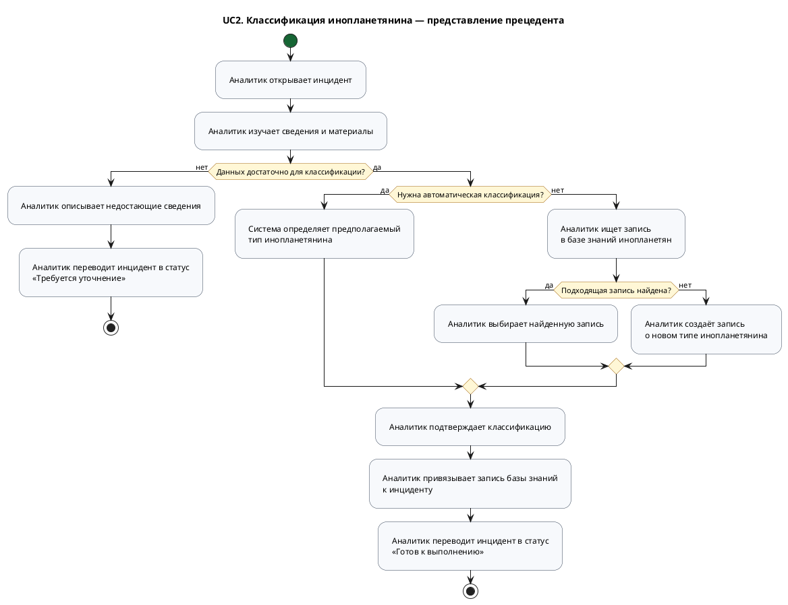

<!-- markdownlint-disable MD013 MD041 -->


```plantuml
@startuml aims_uc2_activity_use_case_view
title UC2. Классификация инопланетянина — представление прецедента
scale max 3800 width

skinparam shadowing false
skinparam activity {
  BackgroundColor #F7F9FC
  BorderColor #334155
  DiamondBackgroundColor #FFF7D6
  DiamondBorderColor #A16207
  StartColor #166534
  EndColor #991B1B
}

<style>
activityDiagram {
  activity {
    Padding 20
  }
}
</style>

start
:Аналитик открывает инцидент;
:Аналитик изучает сведения и материалы;
if (Данных достаточно для классификации?) then (нет)
  :Аналитик описывает недостающие сведения;
  :Аналитик переводит инцидент в статус
  «Требуется уточнение»;
  stop
else (да)
  if (Нужна автоматическая классификация?) then (да)
    :Система определяет предполагаемый
    тип инопланетянина;
  else (нет)
    :Аналитик ищет запись
    в базе знаний инопланетян;
    if (Подходящая запись найдена?) then (да)
      :Аналитик выбирает найденную запись;
    else (нет)
      :Аналитик создаёт запись
      о новом типе инопланетянина;
    endif
  endif

  :Аналитик подтверждает классификацию;
  :Аналитик привязывает запись базы знаний
  к инциденту;
  :Аналитик переводит инцидент в статус
  «Готов к выполнению»;
  stop
endif
@enduml
```

Logical View описывает успешные сценарии протокола между клиентом и сервером без действий пользователя и деталей внутреннего устройства сервера. Работа с базой знаний относится к стороне сервера. Автоматическая классификация и создание записи предусмотрены протоколом, но ещё не реализованы в коде. Предложение классификации не изменяет инцидент: привязка выполняется отдельным запросом, а завершение — только после подтверждения привязки.

```plantuml
@startuml aims_uc2_activity_logical_view
title UC2. Классификация инопланетянина — Logical View
scale max 3800 height

skinparam shadowing false
skinparam activity {
  BackgroundColor #F8FAFC
  BorderColor #334155
  DiamondBackgroundColor #FEF3C7
  DiamondBorderColor #A16207
  StartColor #166534
  EndColor #991B1B
}

<style>
activityDiagram {
  activity {
    Padding 18
  }
}
</style>

start
:[Клиент]
Запрашивает инцидент по идентификатору;
:[Сервер]
Возвращает сведения, материалы, статус
и текущую классификацию;

if (Запрошено уточнение сведений?) then (да)
  :[Клиент]
Отправляет запрос на изменение статуса:
идентификатор инцидента,
статус «Требуется уточнение»,
комментарий о недостающих сведениях;
else (нет)
  if (Запрошена автоматическая классификация?) then (да)
    :[Клиент]
Запрашивает автоматическую классификацию
по идентификатору инцидента;
    :[Сервер]
Возвращает предложенный тип инопланетянина
и идентификатор записи базы знаний
без привязки к инциденту;
  else (нет)
    :[Клиент]
Отправляет запрос на поиск
со строкой названия или описания;
    :[Сервер]
Возвращает подходящие записи базы знаний:
идентификаторы, названия, описания
и уровни угрозы;
    if (Требуется новая запись?) then (да)
      :[Клиент]
Отправляет запрос на создание типа инопланетянина:
название, описание и уровень угрозы;
      :[Сервер]
Создаёт запись базы знаний
и возвращает её данные с идентификатором;
    else (нет)
    endif
  endif

  :[Клиент]
Запрашивает привязку:
идентификатор инцидента
и идентификатор записи базы знаний;
  :[Сервер]
Привязывает запись к инциденту
и возвращает подтверждённую классификацию;
  :[Клиент]
После получения подтверждения привязки
отправляет запрос на изменение статуса:
идентификатор инцидента,
статус «Готов к выполнению»;
endif

:[Сервер]
Изменяет статус, сохраняет переданный комментарий
и возвращает обновлённый инцидент
в подтверждение изменения;
:[Клиент]
Принимает обновлённое состояние инцидента;
stop
@enduml
```

```plantuml
@startuml aims_uc2_activity_implementation_view
' applyChanges(entity) is shorthand for field updates, not an implemented method.
title UC2. Классификация инопланетянина — Implementation View
scale max 2400 height

skinparam shadowing false
skinparam activity {
  BackgroundColor #F8FAFC
  BorderColor #334155
  DiamondBackgroundColor #FEF3C7
  DiamondBorderColor #A16207
  StartColor #166534
  EndColor #991B1B
}

<style>
activityDiagram {
  activity {
    Padding 18
  }
}
</style>

start
:[IncidentDetailPage.tsx]
api.getIncident(token, incidentId);

if (Данных достаточно для классификации?) then (да)
  :[AlienPickerDrawer.tsx]
api.searchAliens(token, query)
{ query.length >= 2, debounce = 300ms };
  :[AlienServiceImpl]
AlienRepository.search(pattern, SEARCH_LIMIT)
{ normalized pattern, SEARCH_LIMIT = 20 };

  if (Инопланетянин выбран и выбор подтверждён?) then (да)
    :[IncidentServiceImpl]
linkAlien(id, request)
{ status = READY_FOR_ANALYSIS, alien exists };
    :[IncidentServiceImpl]
IncidentRepository.save(applyChanges(entity))
{ alienId = request.alienId };
    :[IncidentServiceImpl]
EntityHistoryService.recordChange(EntityType.INCIDENT, id, entity);
  else (нет)
  endif
else (нет)
endif

if (incident.alienId != null?) then (yes)
  :[IncidentStatusSelect.tsx]
applyStatusChange(READY_FOR_EXECUTION);
else (no)
  :[IncidentStatusSelect.tsx]
applyStatusChange(CLARIFICATION_REQUIRED, comment)
{ non-blank comment required };
endif

:[IncidentServiceImpl]
IncidentStatusWorkflow.changeStatus(entity, target)
{ allowed transition, authorized role };

if (target == READY_FOR_EXECUTION?) then (yes)
  :[IncidentStatusWorkflow]
AlienLinkedPrecondition.check(entity);
else (CLARIFICATION_REQUIRED)
endif

:[IncidentStatusWorkflow]
IncidentRepository.save(applyChanges(entity))
{ status = target };

if (target == READY_FOR_EXECUTION?) then (yes)
  :[IncidentStatusWorkflow]
EnqueueNotifyAgentsPostAction.execute(entity);
else (CLARIFICATION_REQUIRED)
  :[IncidentStatusWorkflow]
EnqueueNotifyOperatorClarificationPostAction.execute(entity);
endif

if (comment != null && !comment.isBlank()) then (yes)
  :[IncidentServiceImpl]
IncidentCommentService.createFromStatusChange(id, comment);
else (no)
endif

:[IncidentServiceImpl]
EntityHistoryService.recordChange(EntityType.INCIDENT, id, entity);

:[IncidentStatusSelect.tsx]
onStatusChanged(updated);
stop
@enduml
```

```bash
curl -L https://github.com/plantuml/plantuml/releases/latest/download/plantuml.jar -o /tmp/plantuml.jar
mkdir -p /tmp/aims-uc2-activity-render

# Syntax check
java -Djava.awt.headless=true -jar /tmp/plantuml.jar -checkonly docs/activity/UC2.md

# SVG
java -Djava.awt.headless=true -jar /tmp/plantuml.jar -tsvg -o /tmp/aims-uc2-activity-render docs/activity/UC2.md

# PNG
java -Djava.awt.headless=true -jar /tmp/plantuml.jar -tpng -o /tmp/aims-uc2-activity-render docs/activity/UC2.md
```
