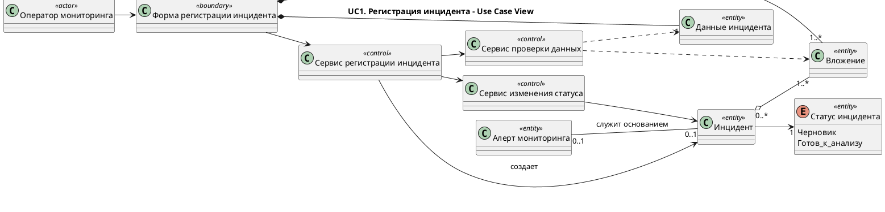
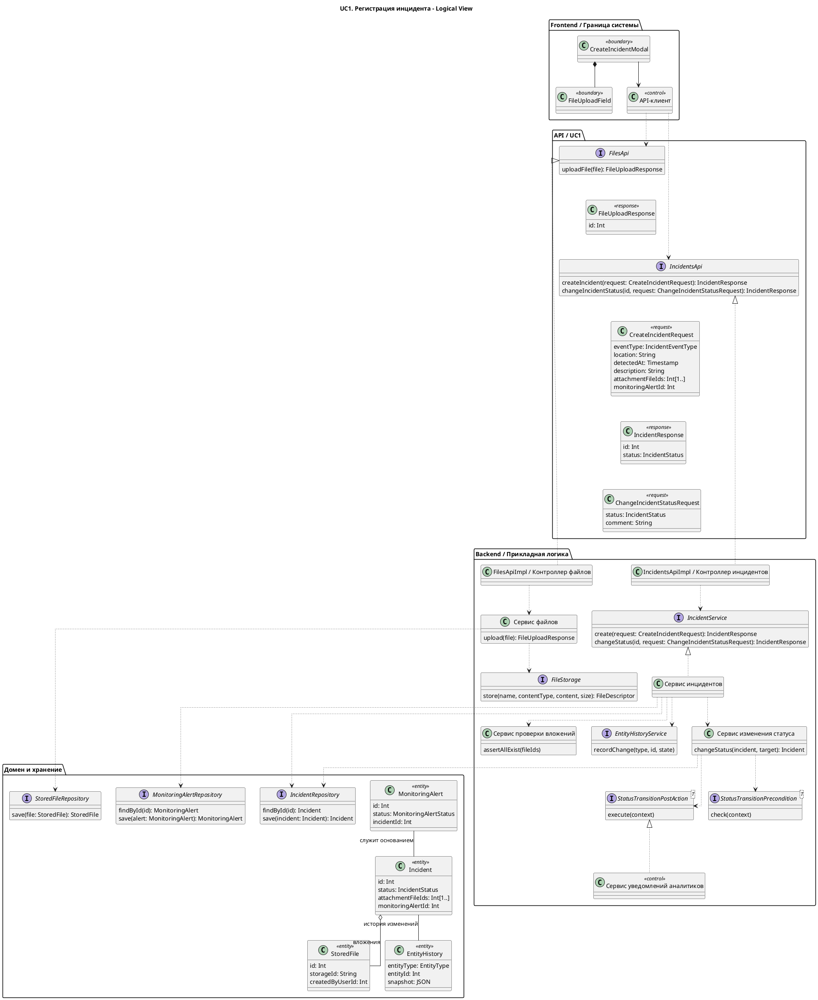

<!-- markdownlint-disable MD041 -->







```plantuml
@startuml aims_uc1_implementation_view
title UC1. Регистрация инцидента - Implementation View
scale max 3800 width

skinparam classAttributeIconSize 0
skinparam linetype ortho
skinparam shadowing false
skinparam defaultFontSize 11
top to bottom direction

package "frontend" {
  interface CreateIncidentModalProps {
    +token: string
    +open: boolean
    +onClose: () => void
    +onCreated: (incident: IncidentResponse) => void
    +initialValues?: CreateIncidentInitialValues | null
  }

  class CreateIncidentModal <<React component>> {
    -eventType: IncidentEventType
    -location: string
    -detectedAt: string
    -description: string
    -monitoringAlertId: number | undefined
    -referenceMediaUrls: string[]
    -attachmentFiles: File[]
    -loading: boolean
    -error: string | null
    -handleSubmit(event: FormEvent): Promise<void>
    +CreateIncidentModal(props: CreateIncidentModalProps): JSX.Element | null
  }

  interface FileUploadFieldProps {
    +label: string
    +files: File[]
    +onChange: (files: File[]) => void
    +disabled?: boolean
  }

  class FileUploadField <<React component>> {
    -dragActive: boolean
    -addFiles(incoming: FileList | File[]): void
    -removeFile(index: number): void
    -handleDragOver(event: DragEvent): void
    -handleDragLeave(event: DragEvent): void
    -handleDrop(event: DragEvent): void
    -openPicker(): void
    +FileUploadField(props: FileUploadFieldProps): JSX.Element
  }

  class ApiClient <<TypeScript module>> {
    -requestJson<T>(path: string, options: RequestInit = {}, token?: string | null): Promise<T>
    +uploadFile(token: string, file: File): Promise<FileUploadResponse>
    +uploadFiles(token: string, files: File[]): Promise<FileUploadResponse[]>
    +createIncident(token: string, payload: CreateIncidentRequest): Promise<IncidentResponse>
    +changeIncidentStatus(token: string, id: number, status: IncidentStatus,%n()\
    \tcomment?: string): Promise<IncidentResponse>
  }

  interface CreateIncidentInitialValues {
    +eventType?: IncidentEventType
    +location?: string
    +detectedAt?: string
    +description?: string
    +monitoringAlertId?: number
    +mediaUrls?: string[]
  }

  interface "CreateIncidentRequest" as TsCreateIncidentRequest {
    +eventType: IncidentEventType
    +location: string
    +detectedAt: string
    +description: string
    +attachmentFileIds: number[]
    +monitoringAlertId?: number
  }

  interface "FileUploadResponse" as TsFileUploadResponse {
    +id: number
    +fileName: string
    +contentType: string
    +fileSize: number
    +createdAt: string
  }

  interface "IncidentResponse" as TsIncidentResponse {
    +id: number
    +status: IncidentStatus
    +eventType: IncidentEventType
    +location: string
    +detectedAt: string
    +description: string
    +attachmentFileIds: number[]
    +monitoringAlertId?: number | null
    +createdAt: string
    +updatedAt: string
  }
}

package "generated API" {
  interface FilesApi {
    +uploadFile(file: MultipartFile): FileUploadResponse
  }

  interface IncidentsApi {
    +createIncident(createIncidentRequest: CreateIncidentRequest): IncidentResponse
    +changeIncidentStatus(id: Long,%n()\
    \tchangeIncidentStatusRequest: ChangeIncidentStatusRequest): IncidentResponse
  }

  class CreateIncidentRequest <<OpenAPI DTO>> {
    -eventType: IncidentEventTypeApi
    -location: String
    -detectedAt: OffsetDateTime
    -description: String
    -attachmentFileIds: List<Long>
    -monitoringAlertId: Long
  }

  class ChangeIncidentStatusRequest <<OpenAPI DTO>> {
    -status: IncidentStatusApi
    -comment: String
  }

  class FileUploadResponse <<OpenAPI DTO>> {
    -id: Long
    -fileName: String
    -contentType: String
    -fileSize: Long
    -createdAt: OffsetDateTime
  }

  class IncidentResponse <<OpenAPI DTO>> {
    -id: Long
    -status: IncidentStatusApi
    -eventType: IncidentEventTypeApi
    -location: String
    -detectedAt: OffsetDateTime
    -description: String
    -attachmentFileIds: List<Long>
    -monitoringAlertId: Long
    -createdAt: OffsetDateTime
    -updatedAt: OffsetDateTime
  }
}

package "controller" {
  class FilesApiImpl {
    -fileService: FileService
    +uploadFile(file: MultipartFile): FileUploadResponse
  }

  class IncidentsApiImpl {
    -incidentService: IncidentService
    +createIncident(createIncidentRequest: CreateIncidentRequest): IncidentResponse
    +changeIncidentStatus(id: Long,%n()\
    \tchangeIncidentStatusRequest: ChangeIncidentStatusRequest): IncidentResponse
  }
}

package "service" {
  interface IncidentService {
    +create(request: CreateIncidentRequest): IncidentResponse
    +changeStatus(id: Long, request: ChangeIncidentStatusRequest): IncidentResponse
  }

  class IncidentServiceImpl {
    -incidentRepository: IncidentRepository
    -monitoringAlertRepository: MonitoringAlertRepository
    -currentUserService: CurrentUserService
    -entityHistoryService: EntityHistoryService
    -incidentStatusWorkflow: IncidentStatusWorkflow
    -incidentCommentService: IncidentCommentService
    -incidentMapper: IncidentMapper
    -attachmentValidator: AttachmentValidator
    -clock: Clock
    +create(request: CreateIncidentRequest): IncidentResponse
    -resolveMonitoringAlertForCreate(monitoringAlertId: Long): MonitoringAlertEntity
    +changeStatus(id: Long, request: ChangeIncidentStatusRequest): IncidentResponse
  }

  class FileService {
    -fileStorage: FileStorage
    -storedFileRepository: StoredFileRepository
    -currentUserService: CurrentUserService
    +upload(file: MultipartFile): FileUploadResponse
    -validateUpload(file: MultipartFile): void
  }

  interface FileStorage {
    +store(originalFileName: String, contentType: String, content: InputStream,%n()\
    \tsizeBytes: long): FileDescriptor
  }

  class LocalDiskFileStorage {
    -storageProperties: StorageProperties
    +store(originalFileName: String, contentType: String, content: InputStream,%n()\
    \tsizeBytes: long): FileDescriptor
    -resolvePath(storageId: String): Path
  }

  class AttachmentValidator {
    -storedFileRepository: StoredFileRepository
    +assertAllExist(attachmentFileIds: List<Long>): void
  }

  class IncidentMapper {
    +toResponse(entity: IncidentEntity): IncidentResponse
    +toModelEventType(dto: IncidentEventTypeApi): IncidentEventType
    +toModelStatus(dto: IncidentStatusApi): IncidentStatus
    +toApiStatus(status: IncidentStatus): IncidentStatusApi
    +toApiEventType(eventType: IncidentEventType): IncidentEventTypeApi
  }

  interface EntityHistoryService {
    +recordChange(entityType: EntityType, entityId: Long, newState: Object): void
    +recordChange(entityType: EntityType, entityId: Long, newState: Object,%n()\
    \tchangedByUserId: Long): void
  }

  class EntityHistoryServiceImpl {
    -entityHistoryRepository: EntityHistoryRepository
    -objectMapper: ObjectMapperWrapper
    -currentUserService: CurrentUserService
    +recordChange(entityType: EntityType, entityId: Long, newState: Object): void
    +recordChange(entityType: EntityType, entityId: Long, newState: Object,%n()\
    \tchangedByUserId: Long): void
    -validateRecordRequest(entityType: EntityType, entityId: Long, newState: Object,%n()\
    \tchangedByUserId: Long): void
  }

  class CurrentUserService {
    +getCurrentUserInfo(): UserInfo
    +getCurrentUserId(): Long
    +hasAnyRole(roles: Role...): boolean
    +hasAnyRole(roleNames: String...): boolean
  }
  class IncidentStatusWorkflow {
    -transitionGraph: IncidentStatusTransitionGraph
    -incidentRepository: IncidentRepository
    -clock: Clock
    +changeStatus(incident: IncidentEntity, target: IncidentStatus): IncidentEntity
  }

  class IncidentStatusTransitionGraph {
    -transitions: Map<StatusTransitionKey, IncidentStatusTransition<IncidentEntity>>
    +isAllowed(from: IncidentStatus, to: IncidentStatus): boolean
    +getTransition(from: IncidentStatus,%n()\
    \tto: IncidentStatus): IncidentStatusTransition<IncidentEntity>
  }

  class "IncidentStatusTransition<T>" as IncidentStatusTransition {
    -from: IncidentStatus
    -to: IncidentStatus
    -preconditions: List<StatusTransitionPrecondition<T>>
    -postActions: List<StatusTransitionPostAction<T>>
  }

  interface "StatusTransitionPrecondition<T>" as StatusTransitionPrecondition {
    +check(context: T): void
  }

  interface "StatusTransitionPostAction<T>" as StatusTransitionPostAction {
    +execute(context: T): void
  }

  class AttachmentsExistPrecondition {
    -attachmentValidator: AttachmentValidator
    +check(context: IncidentEntity): void
  }

  class RolePrecondition {
    -currentUserService: CurrentUserService
    -allowedRoles: Set<Role>
    +RolePrecondition(currentUserService: CurrentUserService, allowedRoles: Role...)
    +check(context: IncidentEntity): void
  }

  class EnqueueNotifyAnalystsPostAction {
    -dbQueueService: DbQueueService
    +execute(context: IncidentEntity): void
  }

  class DbQueueService {
    +produceTask<P extends QueuePayload>(processorClass: Class<? extends DbQueueProcessor<P>>,%n()\
    \tpayload: P): void
  }
}

package "persistence" {
  class IncidentEntity <<JPA entity>> {
    -id: Long
    -status: IncidentStatus
    -eventType: IncidentEventType
    -location: String
    -detectedAt: LocalDateTime
    -description: String
    -attachmentFileIds: List<Long>
    -executorUserIds: List<Long>
    -createdByUserId: Long
    -monitoringAlertId: Long
    -createdAt: LocalDateTime
    -updatedAt: LocalDateTime
  }

  class StoredFileEntity <<JPA entity>> {
    -id: Long
    -storageId: String
    -fileName: String
    -contentType: String
    -fileSize: Long
    -createdAt: Instant
    -createdByUserId: Long
  }

  class MonitoringAlertEntity <<JPA entity>> {
    -id: Long
    -status: MonitoringAlertStatus
    -incidentId: Long
  }

  class EntityHistoryEntity <<JPA entity>> {
    -id: Long
    -entityType: EntityType
    -entityId: Long
    -snapshot: String
    -changedByUserId: Long
    -changedAt: Instant
  }

  interface IncidentRepository <<Spring Data>> {
    +save(entity: IncidentEntity): IncidentEntity
    +findById(id: Long): Optional<IncidentEntity>
  }

  interface StoredFileRepository <<Spring Data>> {
    +save(entity: StoredFileEntity): StoredFileEntity
    +existsById(id: Long): boolean
  }

  interface MonitoringAlertRepository <<Spring Data>> {
    +save(entity: MonitoringAlertEntity): MonitoringAlertEntity
    +findById(id: Long): Optional<MonitoringAlertEntity>
  }

  interface EntityHistoryRepository <<Spring Data>> {
    +save(entity: EntityHistoryEntity): EntityHistoryEntity
  }
}

CreateIncidentModal *-down- FileUploadField
CreateIncidentModal -[dotted]down-> ApiClient

FilesApiImpl -[dotted]up-|> FilesApi
IncidentsApiImpl -[dotted]up-|> IncidentsApi
FilesApiImpl -[dotted]down-> FileService
IncidentsApiImpl -[dotted]down-> IncidentService
IncidentServiceImpl -[dotted]up-|> IncidentService
LocalDiskFileStorage -[dotted]up-|> FileStorage
EntityHistoryServiceImpl -[dotted]up-|> EntityHistoryService

FileService -[dotted]down-> FileStorage
FileService -[dotted]down-> StoredFileRepository
FileService -[dotted]down-> CurrentUserService
IncidentServiceImpl -[dotted]down-> AttachmentValidator
IncidentServiceImpl -[dotted]down-> IncidentRepository
IncidentServiceImpl -[dotted]down-> MonitoringAlertRepository
IncidentServiceImpl -[dotted]down-> IncidentStatusWorkflow
IncidentServiceImpl -[dotted]down-> EntityHistoryService
IncidentServiceImpl -[dotted]down-> CurrentUserService
IncidentServiceImpl -[dotted]down-> IncidentMapper
EntityHistoryServiceImpl -[dotted]down-> EntityHistoryRepository
EntityHistoryServiceImpl -[dotted]down-> CurrentUserService

IncidentStatusWorkflow -[dotted]down-> IncidentStatusTransitionGraph
IncidentStatusWorkflow -[dotted]down-> IncidentRepository
IncidentStatusTransitionGraph *-down- IncidentStatusTransition
IncidentStatusTransition o-down- StatusTransitionPrecondition
IncidentStatusTransition o-down- StatusTransitionPostAction
AttachmentsExistPrecondition -[dotted]up-|> StatusTransitionPrecondition
RolePrecondition -[dotted]up-|> StatusTransitionPrecondition
EnqueueNotifyAnalystsPostAction -[dotted]up-|> StatusTransitionPostAction
AttachmentsExistPrecondition -[dotted]down-> AttachmentValidator
AttachmentValidator -[dotted]down-> StoredFileRepository
RolePrecondition -[dotted]down-> CurrentUserService
EnqueueNotifyAnalystsPostAction -[dotted]down-> DbQueueService

IncidentEntity o-down- StoredFileEntity : attachmentFileIds
MonitoringAlertEntity -down- IncidentEntity : monitoringAlertId / incidentId
IncidentEntity -down- EntityHistoryEntity : entityId

ApiClient -[hidden]down-> FilesApi
FilesApi -[hidden]down-> FileUploadResponse
FileUploadResponse -[hidden]down-> IncidentsApi
IncidentsApi -[hidden]down-> CreateIncidentRequest
CreateIncidentRequest -[hidden]down-> ChangeIncidentStatusRequest
ChangeIncidentStatusRequest -[hidden]down-> IncidentResponse
IncidentResponse -[hidden]down-> IncidentsApiImpl
IncidentsApiImpl -[hidden]down-> IncidentServiceImpl
LocalDiskFileStorage -[hidden]down-> IncidentStatusWorkflow
DbQueueService -[hidden]down-> MonitoringAlertEntity

@enduml
```

```bash
curl -L https://github.com/plantuml/plantuml/releases/latest/download/plantuml.jar -o /tmp/plantuml.jar
mkdir -p /tmp/aims-uc1-classes-render

# Syntax check
java -Djava.awt.headless=true -jar /tmp/plantuml.jar -checkonly docs/classes/UC1.md

# SVG
java -Djava.awt.headless=true -jar /tmp/plantuml.jar -tsvg -o /tmp/aims-uc1-classes-render docs/classes/UC1.md

# PNG
java -Djava.awt.headless=true -jar /tmp/plantuml.jar -tpng -o /tmp/aims-uc1-classes-render docs/classes/UC1.md
```
