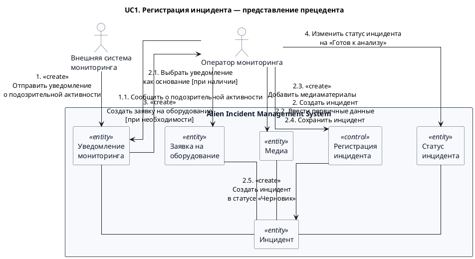
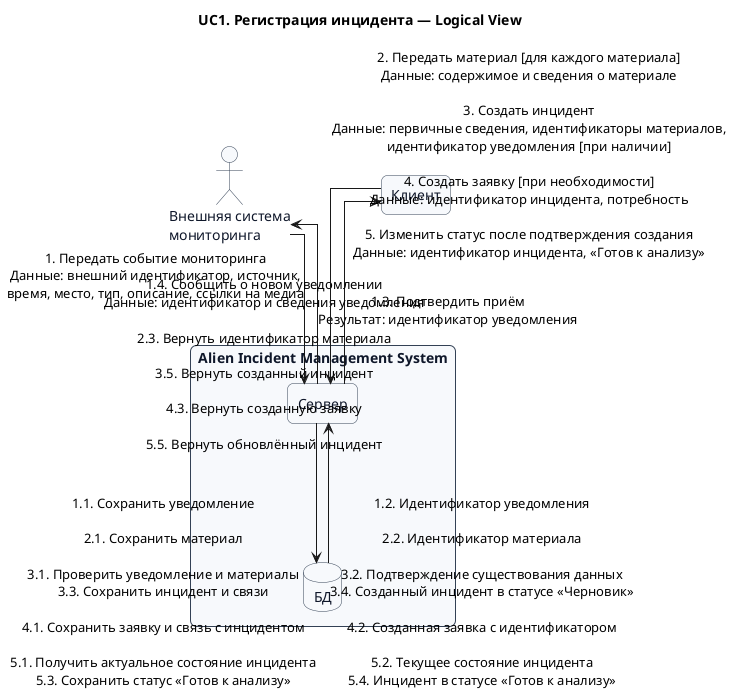
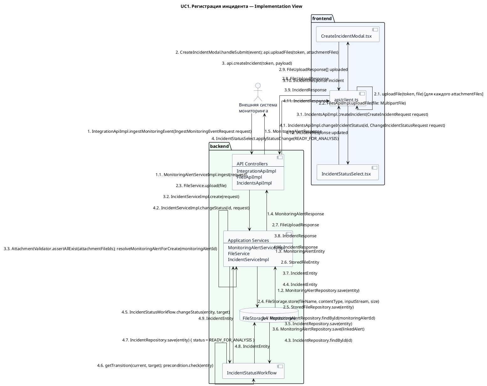

<!-- markdownlint-disable MD013 MD041 -->


```plantuml
@startuml aims_uc1_cooperative_use_case_view
title UC1. Регистрация инцидента — представление прецедента
scale max 3800 width
top to bottom direction

skinparam shadowing false
skinparam linetype ortho
skinparam nodesep 70
skinparam ranksep 110
skinparam classAttributeIconSize 0
skinparam actor {
  BackgroundColor #F7F9FC
  BorderColor #334155
  FontColor #0F172A
}
skinparam rectangle {
  BackgroundColor #F7F9FC
  BorderColor #334155
  FontColor #0F172A
}

actor "Внешняя система\nмониторинга" as ExternalMonitoring
actor "Оператор мониторинга" as Operator

rectangle "Alien Incident Management System" as AIMS {
  rectangle "Уведомление\nмониторинга" as MonitoringNotification <<entity>>
  rectangle "Регистрация\nинцидента" as Registration <<control>>
  rectangle "Медиа" as Media <<entity>>
  rectangle "Инцидент" as Incident <<entity>>
  rectangle "Заявка на\nоборудование" as EquipmentRequest <<entity>>
  rectangle "Статус\nинцидента" as IncidentStatus <<entity>>
}

ExternalMonitoring --> MonitoringNotification : 1. <<create>>\nОтправить уведомление\nо подозрительной активности
MonitoringNotification --> Operator : 1.1. Сообщить о подозрительной активности

Operator --> Registration : 2. Создать инцидент\n2.2. Ввести первичные данные\n2.4. Сохранить инцидент

Operator --> MonitoringNotification : 2.1. Выбрать уведомление\nкак основание [при наличии]
Operator --> Media : 2.3. <<create>>\nДобавить медиаматериалы
Registration --> Incident : 2.5. <<create>>\nСоздать инцидент\nв статусе «Черновик»
MonitoringNotification -- Incident
Media -- Incident

Operator --> EquipmentRequest : 3. <<create>>\nСоздать заявку на оборудование\n[при необходимости]
EquipmentRequest -- Incident

Operator --> IncidentStatus : 4. Изменить статус инцидента\nна «Готов к анализу»
IncidentStatus -- Incident
@enduml
```

Logical View фиксирует протокол между внешней системой мониторинга, клиентом, сервером и базой данных. Последующие запросы используют подтверждения предыдущих операций: идентификаторы уведомления и материалов передаются при создании инцидента, а заявка и изменение статуса относятся к уже созданному инциденту. Диаграмма не определяет транспорт, программные модули и физическую схему хранения.


```plantuml
@startuml aims_uc1_cooperative_logical_view
title UC1. Регистрация инцидента — Logical View
scale max 3800 width
top to bottom direction

skinparam shadowing false
skinparam linetype ortho
skinparam nodesep 90
skinparam ranksep 140
skinparam actor {
  BackgroundColor #F7F9FC
  BorderColor #334155
  FontColor #0F172A
}
skinparam rectangle {
  BackgroundColor #F7F9FC
  BorderColor #334155
  FontColor #0F172A
  RoundCorner 12
}
skinparam database {
  BackgroundColor #F7F9FC
  BorderColor #334155
  FontColor #0F172A
}

actor "Внешняя система\nмониторинга" as LogicalExternal
rectangle "Клиент" as Client

rectangle "Alien Incident Management System" as LogicalSystem {
  rectangle "Сервер" as Server
  database "БД" as Database
}

LogicalExternal --> Server : 1. Передать событие мониторинга\nДанные: внешний идентификатор, источник,\nвремя, место, тип, описание, ссылки на медиа
Server --> LogicalExternal : 1.3. Подтвердить приём\nРезультат: идентификатор уведомления
Server --> Database : 1.1. Сохранить уведомление\n\n2.1. Сохранить материал\n\n3.1. Проверить уведомление и материалы\n3.3. Сохранить инцидент и связи\n\n4.1. Сохранить заявку и связь с инцидентом\n\n5.1. Получить актуальное состояние инцидента\n5.3. Сохранить статус «Готов к анализу»
Database --> Server : 1.2. Идентификатор уведомления\n\n2.2. Идентификатор материала\n\n3.2. Подтверждение существования данных\n3.4. Созданный инцидент в статусе «Черновик»\n\n4.2. Созданная заявка с идентификатором\n\n5.2. Текущее состояние инцидента\n5.4. Инцидент в статусе «Готов к анализу»
Server --> Client : 1.4. Сообщить о новом уведомлении\nДанные: идентификатор и сведения уведомления\n\n2.3. Вернуть идентификатор материала\n\n3.5. Вернуть созданный инцидент\n\n4.3. Вернуть созданную заявку\n\n5.5. Вернуть обновлённый инцидент
Client --> Server : 2. Передать материал [для каждого материала]\nДанные: содержимое и сведения о материале\n\n3. Создать инцидент\nДанные: первичные сведения, идентификаторы материалов,\nидентификатор уведомления [при наличии]\n\n4. Создать заявку [при необходимости]\nДанные: идентификатор инцидента, потребность\n\n5. Изменить статус после подтверждения создания\nДанные: идентификатор инцидента, «Готов к анализу»
@enduml
```

Implementation View показывает основные вызовы реализованного успешного сценария UC1. Контроллеры, прикладные сервисы и persistence объединены в смысловые узлы; конкретный класс или зависимость указан в подписи сообщения. Для читаемости опущены управление React-состоянием, mapper-классы, получение текущего пользователя, запись истории, детали `requestJson` и выполнение очередей уведомлений. Создание заявки на оборудование не показано, поскольку соответствующая часть UC1 в коде не реализована.


```plantuml
@startuml aims_uc1_cooperative_implementation_view
title UC1. Регистрация инцидента — Implementation View
scale max 3800 width
top to bottom direction

skinparam shadowing false
skinparam linetype ortho
skinparam nodesep 80
skinparam ranksep 130
skinparam actor {
  BackgroundColor #F7F9FC
  BorderColor #334155
  FontColor #0F172A
}
skinparam component {
  BackgroundColor #F8FAFC
  BorderColor #334155
  FontColor #0F172A
}
skinparam database {
  BackgroundColor #F8FAFC
  BorderColor #334155
  FontColor #0F172A
}

actor "Внешняя система\nмониторинга" as ImplExternal

package "frontend" #EFF6FF {
  component "CreateIncidentModal.tsx" as CreateModal
  component "IncidentStatusSelect.tsx" as StatusSelect
  component "api/client.ts" as ApiClient
}

package "backend" #F0FDF4 {
  component "API Controllers\n----\nIntegrationApiImpl\nFilesApiImpl\nIncidentsApiImpl" as Controllers
  component "Application Services\n----\nMonitoringAlertServiceImpl\nFileService\nIncidentServiceImpl" as Services
  component "IncidentStatusWorkflow" as StatusWorkflow
  database "FileStorage / Repositories" as Persistence
}

ImplExternal --> Controllers : 1. IntegrationApiImpl.ingestMonitoringEvent(IngestMonitoringEventRequest request)
Controllers --> Services : 1.1. MonitoringAlertServiceImpl.ingest(request)\n\n2.3. FileService.upload(file)\n\n3.2. IncidentServiceImpl.create(request)\n\n4.2. IncidentServiceImpl.changeStatus(id, request)
Services --> Persistence : 1.2. MonitoringAlertRepository.save(entity)\n\n2.4. FileStorage.store(fileName, contentType, inputStream, size)\n2.5. StoredFileRepository.save(entity)\n\n3.4. MonitoringAlertRepository.findById(monitoringAlertId)\n3.5. IncidentRepository.save(entity)\n3.6. MonitoringAlertRepository.save(linkedAlert)\n\n4.3. IncidentRepository.findById(id)
Persistence --> Services : 1.3. MonitoringAlertEntity\n\n2.6. StoredFileEntity\n\n3.7. IncidentEntity\n\n4.4. IncidentEntity
Services --> Controllers : 1.4. MonitoringAlertResponse\n\n2.7. FileUploadResponse\n\n3.8. IncidentResponse\n\n4.10. IncidentResponse
Controllers --> ImplExternal : 1.5. MonitoringAlertResponse

CreateModal --> ApiClient : 2. CreateIncidentModal.handleSubmit(event); api.uploadFiles(token, attachmentFiles)\n\n3. api.createIncident(token, payload)
ApiClient --> ApiClient : 2.1. uploadFile(token, file) [для каждого attachmentFiles]
ApiClient --> Controllers : 2.2. FilesApiImpl.uploadFile(file: MultipartFile)\n\n3.1. IncidentsApiImpl.createIncident(CreateIncidentRequest request)\n\n4.1. IncidentsApiImpl.changeIncidentStatus(id, ChangeIncidentStatusRequest request)
Services --> Services : 3.3. AttachmentValidator.assertAllExist(attachmentFileIds); resolveMonitoringAlertForCreate(monitoringAlertId)
Controllers --> ApiClient : 2.8. FileUploadResponse\n\n3.9. IncidentResponse\n\n4.11. IncidentResponse
ApiClient --> CreateModal : 2.9. FileUploadResponse[] uploaded\n\n3.10. IncidentResponse incident

StatusSelect --> ApiClient : 4. IncidentStatusSelect.applyStatusChange(READY_FOR_ANALYSIS)
Services --> StatusWorkflow : 4.5. IncidentStatusWorkflow.changeStatus(entity, target)
StatusWorkflow --> StatusWorkflow : 4.6. getTransition(current, target); precondition.check(entity)
StatusWorkflow --> Persistence : 4.7. IncidentRepository.save(entity) { status = READY_FOR_ANALYSIS }
Persistence --> StatusWorkflow : 4.8. IncidentEntity
StatusWorkflow --> Services : 4.9. IncidentEntity
ApiClient --> StatusSelect : 4.12. IncidentResponse updated
@enduml
```

## Генерация диаграмм

```bash
curl -L https://github.com/plantuml/plantuml/releases/latest/download/plantuml.jar -o /tmp/plantuml.jar
mkdir -p /tmp/aims-uc1-cooperative-render

# Проверка синтаксиса
java -Djava.awt.headless=true -jar /tmp/plantuml.jar -checkonly docs/cooperative/UC1.md

# SVG
java -Djava.awt.headless=true -jar /tmp/plantuml.jar -tsvg -o /tmp/aims-uc1-cooperative-render docs/cooperative/UC1.md

# PNG
java -Djava.awt.headless=true -jar /tmp/plantuml.jar -tpng -o /tmp/aims-uc1-cooperative-render docs/cooperative/UC1.md
```
