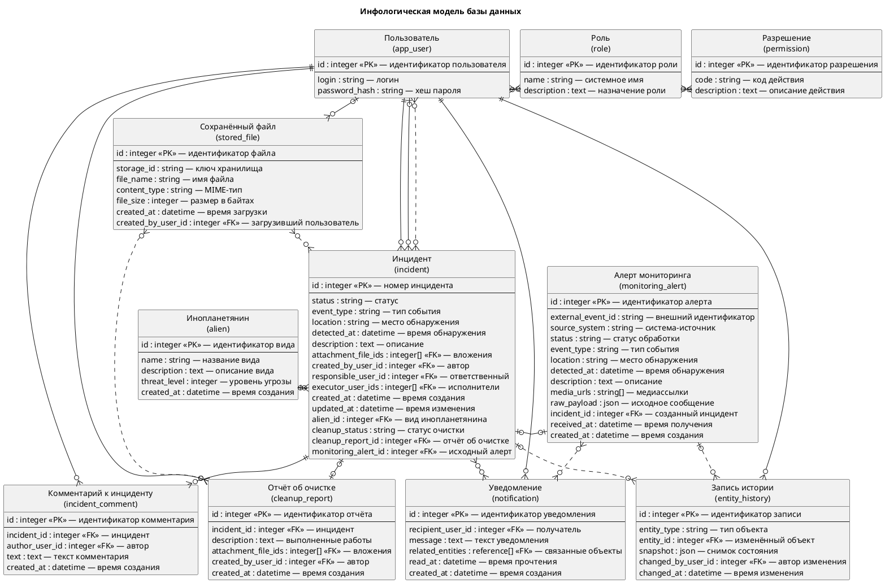

# Data Base Diagram

## Инфологическая модель



## Даталогическая модель

```plantuml
@startuml aims_datalogical_model
!pragma layout smetana
title Даталогическая модель базы данных

hide circle
hide methods
skinparam linetype ortho
skinparam classAttributeIconSize 0
skinparam shadowing false
top to bottom direction

  class "permission" as permission {
    id : BIGSERIAL <<PK>>
    --
    code : TEXT <<UQ>> <<NN>>
    description : TEXT
  }

  class "role" as role {
    id : BIGSERIAL <<PK>>
    --
    name : TEXT <<UQ>> <<NN>>
    description : TEXT
  }

  class "role_permission" as role_permission {
    role_id : BIGINT <<PK, FK>>
    permission_id : BIGINT <<PK, FK>>
  }

  class "app_user" as app_user {
    id : BIGSERIAL <<PK>>
    --
    login : TEXT <<UQ>> <<NN>>
    password_hash : TEXT <<NN>>
  }

  class "user_role" as user_role {
    user_id : BIGINT <<PK, FK>>
    role_id : BIGINT <<PK, FK>>
  }

  class "incident" as incident {
    id : BIGSERIAL <<PK>>
    --
    status : TEXT <<NN>>
    event_type : TEXT <<NN>>
    location : TEXT <<NN>>
    detected_at : TIMESTAMP <<NN>>
    description : TEXT <<NN>>
    attachment_file_ids : JSONB <<DEFAULT '[]'>> <<NN>>
    created_by_user_id : BIGINT <<FK>> <<NN>>
    responsible_user_id : BIGINT <<FK>>
    executor_user_ids : JSONB <<DEFAULT '[]'>> <<NN>>
    created_at : TIMESTAMP <<DEFAULT now()>> <<NN>>
    updated_at : TIMESTAMP <<DEFAULT now()>> <<NN>>
    alien_id : BIGINT <<FK>>
    cleanup_status : TEXT
    cleanup_report_id : BIGINT <<FK>>
    monitoring_alert_id : BIGINT <<FK, UQ partial>>
  }

  class "incident_comment" as incident_comment {
    id : BIGSERIAL <<PK>>
    --
    incident_id : BIGINT <<FK>> <<NN>>
    author_user_id : BIGINT <<FK>> <<NN>>
    text : TEXT <<NN>>
    created_at : TIMESTAMPTZ <<DEFAULT now()>> <<NN>>
  }

  class "alien" as alien {
    id : BIGSERIAL <<PK>>
    --
    name : TEXT <<NN>>
    description : TEXT <<NN>>
    threat_level : SMALLINT <<NN>>
    created_at : TIMESTAMP <<DEFAULT now()>> <<NN>>
  }

  class "cleanup_report" as cleanup_report {
    id : BIGSERIAL <<PK>>
    --
    incident_id : BIGINT <<FK, UQ>> <<NN>>
    description : TEXT <<NN>>
    attachment_file_ids : JSONB <<DEFAULT '[]'>> <<NN>>
    created_by_user_id : BIGINT <<FK>> <<NN>>
    created_at : TIMESTAMP <<DEFAULT now()>> <<NN>>
  }

  class "monitoring_alert" as monitoring_alert {
    id : BIGSERIAL <<PK>>
    --
    external_event_id : TEXT <<UQ>> <<NN>>
    source_system : TEXT <<NN>>
    status : TEXT <<NN>>
    event_type : TEXT <<NN>>
    location : TEXT <<NN>>
    detected_at : TIMESTAMP <<NN>>
    description : TEXT <<NN>>
    media_urls : JSONB <<DEFAULT '[]'>> <<NN>>
    raw_payload : JSONB <<NN>>
    incident_id : BIGINT <<FK>>
    received_at : TIMESTAMP <<DEFAULT now()>> <<NN>>
    created_at : TIMESTAMP <<DEFAULT now()>> <<NN>>
  }

  class "queue_tasks" as queue_tasks {
    id : BIGSERIAL <<PK>>
    --
    queue_name : TEXT <<NN>>
    payload : TEXT
    created_at : TIMESTAMP WITH TIME ZONE <<DEFAULT now()>>
    next_process_at : TIMESTAMP WITH TIME ZONE <<DEFAULT now()>>
    attempt : INTEGER <<DEFAULT 0>>
    reenqueue_attempt : INTEGER <<DEFAULT 0>>
    total_attempt : INTEGER <<DEFAULT 0>>
  }

  class "stored_file" as stored_file {
    id : BIGSERIAL <<PK>>
    --
    storage_id : TEXT <<UQ>> <<NN>>
    file_name : TEXT <<NN>>
    content_type : TEXT <<NN>>
    file_size : BIGINT <<NN>>
    created_at : TIMESTAMPTZ <<DEFAULT now()>> <<NN>>
    created_by_user_id : BIGINT <<FK>>
  }

  class "entity_history" as entity_history {
    id : BIGSERIAL <<PK>>
    --
    entity_type : TEXT <<NN>>
    entity_id : BIGINT <<NN>>
    snapshot : JSONB <<NN>>
    changed_by_user_id : BIGINT <<FK>> <<NN>>
    changed_at : TIMESTAMPTZ <<DEFAULT now()>> <<NN>>
  }

  class "notification" as notification {
    id : BIGSERIAL <<PK>>
    --
    recipient_user_id : BIGINT <<FK>> <<NN>>
    message : TEXT <<NN>>
    related_entities : JSONB <<DEFAULT '[]'>> <<NN>>
    read_at : TIMESTAMPTZ
    created_at : TIMESTAMPTZ <<DEFAULT now()>> <<NN>>
  }

role ||--o{ role_permission
permission ||--o{ role_permission
app_user ||--o{ user_role
role ||--o{ user_role

app_user |o--o{ stored_file
app_user ||--o{ entity_history
app_user ||--o{ notification

app_user ||--o{ incident
app_user |o--o{ incident
alien |o--o{ incident
cleanup_report |o--o{ incident
monitoring_alert |o--o| incident

incident ||--o{ incident_comment
app_user ||--o{ incident_comment
incident ||--o| cleanup_report
app_user ||--o{ cleanup_report
incident |o--o{ monitoring_alert

stored_file }o..o{ incident
stored_file }o..o{ cleanup_report
app_user }o..o{ incident
incident }o..o{ notification
monitoring_alert }o..o{ notification
incident |o..o{ entity_history
monitoring_alert |o..o{ entity_history

permission -[hidden]right-> role
role -[hidden]right-> app_user
app_user -[hidden]right-> queue_tasks

role_permission -[hidden]right-> user_role
user_role -[hidden]right-> incident
incident -[hidden]right-> monitoring_alert

alien -[hidden]right-> incident_comment
incident_comment -[hidden]right-> cleanup_report
cleanup_report -[hidden]right-> stored_file
stored_file -[hidden]right-> notification
notification -[hidden]right-> entity_history

app_user -[hidden]down-> incident
incident -[hidden]down-> cleanup_report

@enduml
```



## Генерация диаграмм

```bash
curl -L https://github.com/plantuml/plantuml/releases/latest/download/plantuml.jar -o /tmp/plantuml.jar
mkdir -p /tmp/aims-er-render

# SVG
java -Djava.awt.headless=true -jar /tmp/plantuml.jar -tsvg -o /tmp/aims-er-render docs/entity-relation.md

# PNG
java -Djava.awt.headless=true -jar /tmp/plantuml.jar -tpng -o /tmp/aims-er-render docs/entity-relation.md
```
