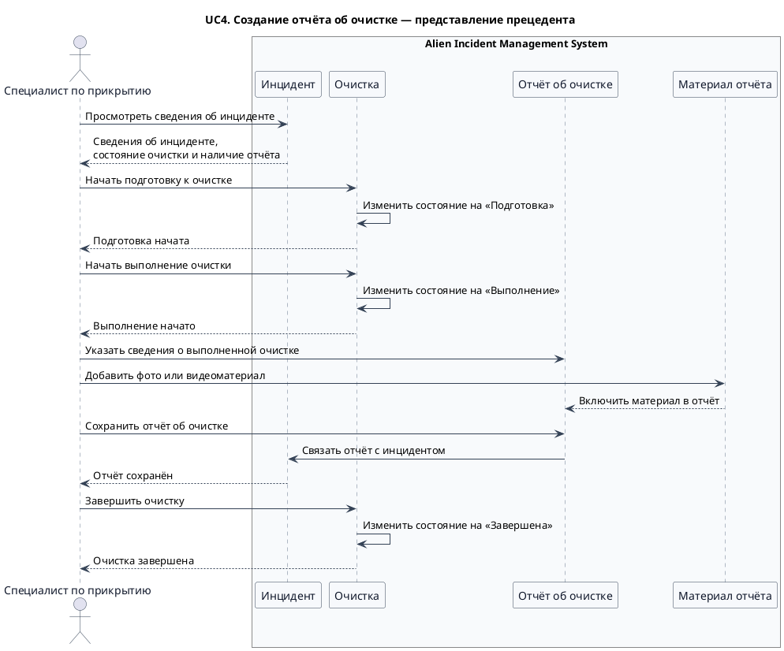
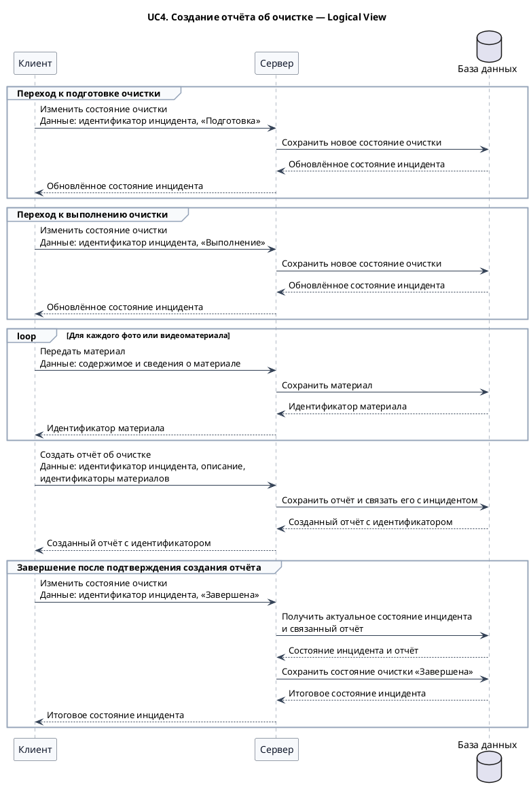
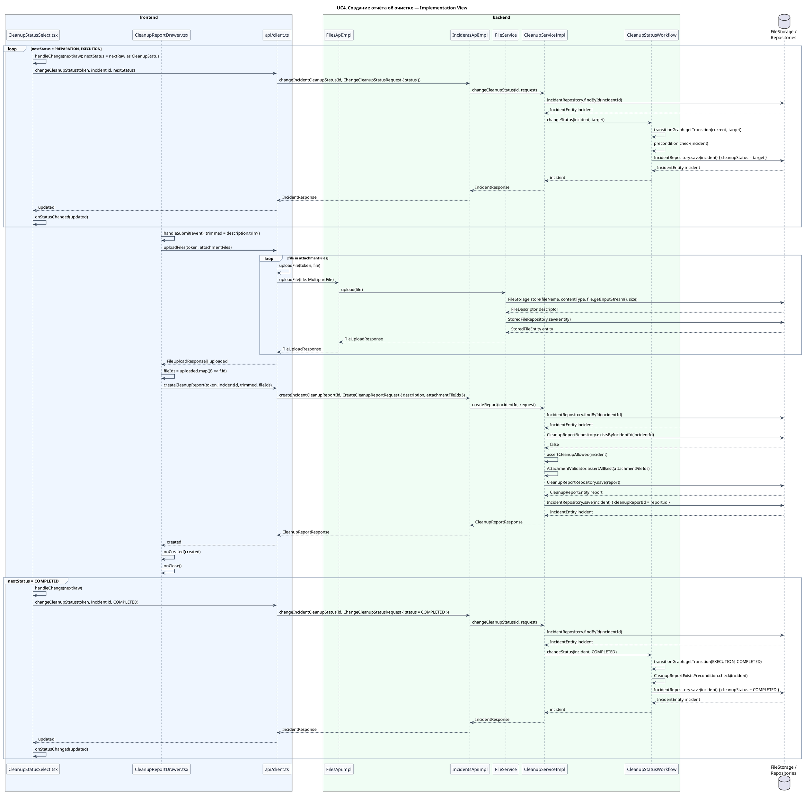

<!-- markdownlint-disable MD013 MD041 -->



Logical View фиксирует успешный протокол между клиентом, сервером и базой данных. Клиент использует подтверждения предыдущих операций в последующих запросах: идентификаторы загруженных материалов передаются при создании отчёта, а завершение очистки запрашивается только после получения созданного отчёта. Диаграмма не определяет транспорт, программные модули и физическую схему хранения.



Implementation View показывает основные вызовы успешного сценария в реализованном коде. Физическое файловое хранилище и репозитории объединены на одной линии жизни для компактности; конкретный получатель указан в подписи каждого вызова. Вспомогательные mapper-классы, запись истории, управление React-состоянием и постановка уведомления в очередь опущены.



## Генерация диаграмм

```bash
curl -L https://github.com/plantuml/plantuml/releases/latest/download/plantuml.jar -o /tmp/plantuml.jar
mkdir -p /tmp/aims-uc4-sequence-render

# Проверка синтаксиса
java -Djava.awt.headless=true -jar /tmp/plantuml.jar -checkonly docs/sequence/UC4.md

# SVG
java -Djava.awt.headless=true -jar /tmp/plantuml.jar -tsvg -o /tmp/aims-uc4-sequence-render docs/sequence/UC4.md

# PNG
java -Djava.awt.headless=true -jar /tmp/plantuml.jar -tpng -o /tmp/aims-uc4-sequence-render docs/sequence/UC4.md
```
