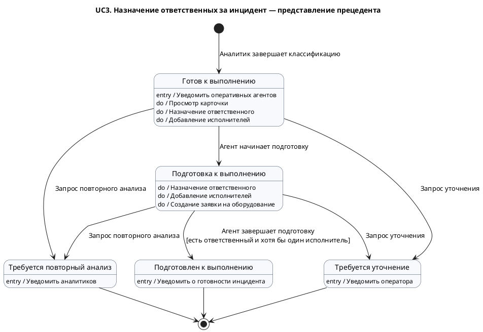

<!-- markdownlint-disable MD013 MD041 -->



## Генерация диаграммы

```bash
curl -L https://github.com/plantuml/plantuml/releases/latest/download/plantuml.jar -o /tmp/plantuml.jar
mkdir -p /tmp/aims-uc3-state-machine-render

# Проверка синтаксиса
java -Djava.awt.headless=true -jar /tmp/plantuml.jar -checkonly docs/state-machine/UC3.md

# SVG
java -Djava.awt.headless=true -jar /tmp/plantuml.jar -tsvg -o /tmp/aims-uc3-state-machine-render docs/state-machine/UC3.md

# PNG
java -Djava.awt.headless=true -jar /tmp/plantuml.jar -tpng -o /tmp/aims-uc3-state-machine-render docs/state-machine/UC3.md
```
