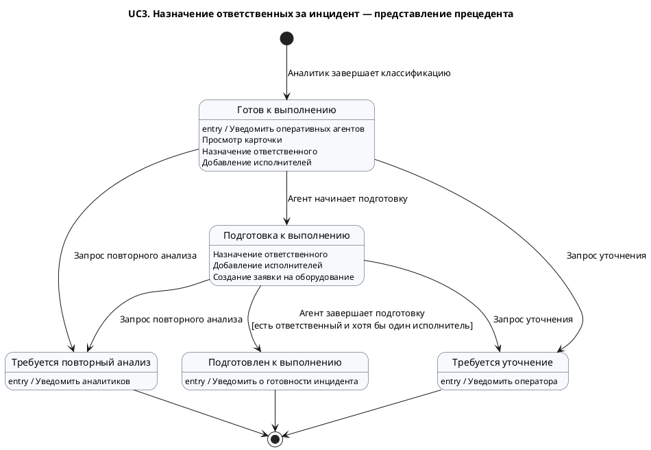
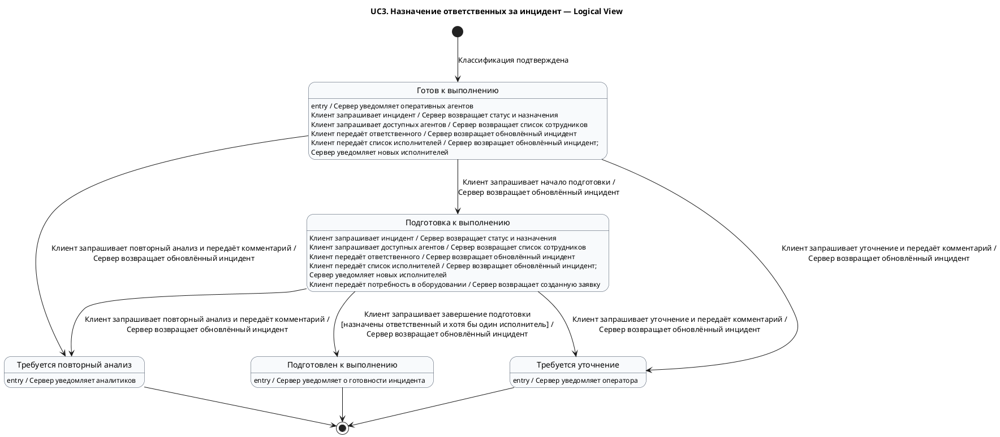
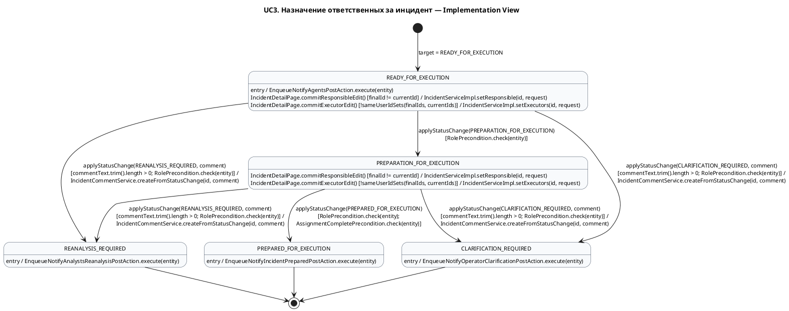

<!-- markdownlint-disable MD013 MD041 -->


```plantuml
@startuml aims_uc3_state_machine_use_case_view
title UC3. Назначение ответственных за инцидент — представление прецедента
scale max 3800 width

skinparam shadowing false
skinparam state {
  BackgroundColor #F7F9FC
  BorderColor #334155
  StartColor #166534
  EndColor #991B1B
}

state "Готов к выполнению" as Ready
state "Подготовка к выполнению" as Preparation
state "Подготовлен к выполнению" as Prepared
state "Требуется уточнение" as Clarification
state "Требуется повторный анализ" as Reanalysis

Ready : entry / Уведомить оперативных агентов
Ready : Просмотр карточки
Ready : Назначение ответственного
Ready : Добавление исполнителей
Preparation : Назначение ответственного
Preparation : Добавление исполнителей
Preparation : Создание заявки на оборудование
Prepared : entry / Уведомить о готовности инцидента
Clarification : entry / Уведомить оператора
Reanalysis : entry / Уведомить аналитиков

[*] --> Ready : Аналитик завершает классификацию
Ready --> Preparation : Агент начинает подготовку
Preparation --> Prepared : Агент завершает подготовку\n[есть ответственный и хотя бы один исполнитель]

Ready --> Clarification : Запрос уточнения
Ready --> Reanalysis : Запрос повторного анализа
Preparation --> Clarification : Запрос уточнения
Preparation --> Reanalysis : Запрос повторного анализа

Prepared --> [*]
Clarification --> [*]
Reanalysis --> [*]
@enduml
```

Logical View описывает протокол между клиентом и сервером: состав запросов, порядок подтверждений, условия смены состояния и отправку уведомлений. Диаграмма не привязана к транспортному протоколу, программным модулям или способу хранения данных.


```plantuml
@startuml aims_uc3_state_machine_logical_view
title UC3. Назначение ответственных за инцидент — Logical View
scale max 3800 width

skinparam shadowing false
skinparam state {
  BackgroundColor #F8FAFC
  BorderColor #334155
  StartColor #166534
  EndColor #991B1B
}

state "Готов к выполнению" as LogicalReady
state "Подготовка к выполнению" as LogicalPreparation
state "Подготовлен к выполнению" as LogicalPrepared
state "Требуется уточнение" as LogicalClarification
state "Требуется повторный анализ" as LogicalReanalysis

LogicalReady : entry / Сервер уведомляет оперативных агентов
LogicalReady : Клиент запрашивает инцидент / Сервер возвращает статус и назначения
LogicalReady : Клиент запрашивает доступных агентов / Сервер возвращает список сотрудников
LogicalReady : Клиент передаёт ответственного / Сервер возвращает обновлённый инцидент
LogicalReady : Клиент передаёт список исполнителей / Сервер возвращает обновлённый инцидент;\nСервер уведомляет новых исполнителей

LogicalPreparation : Клиент запрашивает инцидент / Сервер возвращает статус и назначения
LogicalPreparation : Клиент запрашивает доступных агентов / Сервер возвращает список сотрудников
LogicalPreparation : Клиент передаёт ответственного / Сервер возвращает обновлённый инцидент
LogicalPreparation : Клиент передаёт список исполнителей / Сервер возвращает обновлённый инцидент;\nСервер уведомляет новых исполнителей
LogicalPreparation : Клиент передаёт потребность в оборудовании / Сервер возвращает созданную заявку

LogicalPrepared : entry / Сервер уведомляет о готовности инцидента
LogicalClarification : entry / Сервер уведомляет оператора
LogicalReanalysis : entry / Сервер уведомляет аналитиков

[*] --> LogicalReady : Классификация подтверждена
LogicalReady --> LogicalPreparation : Клиент запрашивает начало подготовки /\nСервер возвращает обновлённый инцидент
LogicalPreparation --> LogicalPrepared : Клиент запрашивает завершение подготовки\n[назначены ответственный и хотя бы один исполнитель] /\nСервер возвращает обновлённый инцидент

LogicalReady --> LogicalClarification : Клиент запрашивает уточнение и передаёт комментарий /\nСервер возвращает обновлённый инцидент
LogicalReady --> LogicalReanalysis : Клиент запрашивает повторный анализ и передаёт комментарий /\nСервер возвращает обновлённый инцидент
LogicalPreparation --> LogicalClarification : Клиент запрашивает уточнение и передаёт комментарий /\nСервер возвращает обновлённый инцидент
LogicalPreparation --> LogicalReanalysis : Клиент запрашивает повторный анализ и передаёт комментарий /\nСервер возвращает обновлённый инцидент

LogicalPrepared --> [*]
LogicalClarification --> [*]
LogicalReanalysis --> [*]
@enduml
```

Implementation View показывает состояние `IncidentEntity.status` и основные методы, которые меняют назначения или выполняют переходы UC3. Все переходы статуса инициируются методом `IncidentStatusSelect.applyStatusChange(...)` и проходят цепочку `IncidentServiceImpl.changeStatus(id, request)` → `IncidentStatusWorkflow.changeStatus(entity, target)`. Workflow получает переход из `IncidentStatusTransitionGraph`, выполняет его preconditions, сохраняет `IncidentEntity`, запускает post-actions, после чего сервис сохраняет комментарий и историю изменения. Для читаемости одинаковые post-actions входящих переходов показаны как `entry /` целевого состояния; в коде они зарегистрированы в `IncidentStatusTransitionGraph`.


```plantuml
@startuml aims_uc3_state_machine_implementation_view
title UC3. Назначение ответственных за инцидент — Implementation View
scale max 3800 width

skinparam shadowing false
skinparam defaultFontSize 11
skinparam state {
  BackgroundColor #F8FAFC
  BorderColor #334155
  StartColor #166534
  EndColor #991B1B
}

state "READY_FOR_EXECUTION" as ImplReady
state "PREPARATION_FOR_EXECUTION" as ImplPreparation
state "PREPARED_FOR_EXECUTION" as ImplPrepared
state "CLARIFICATION_REQUIRED" as ImplClarification
state "REANALYSIS_REQUIRED" as ImplReanalysis

ImplReady : entry / EnqueueNotifyAgentsPostAction.execute(entity)
ImplReady : IncidentDetailPage.commitResponsibleEdit() [finalId != currentId] / IncidentServiceImpl.setResponsible(id, request)
ImplReady : IncidentDetailPage.commitExecutorEdit() [!sameUserIdSets(finalIds, currentIds)] / IncidentServiceImpl.setExecutors(id, request)

ImplPreparation : IncidentDetailPage.commitResponsibleEdit() [finalId != currentId] / IncidentServiceImpl.setResponsible(id, request)
ImplPreparation : IncidentDetailPage.commitExecutorEdit() [!sameUserIdSets(finalIds, currentIds)] / IncidentServiceImpl.setExecutors(id, request)

ImplPrepared : entry / EnqueueNotifyIncidentPreparedPostAction.execute(entity)
ImplClarification : entry / EnqueueNotifyOperatorClarificationPostAction.execute(entity)
ImplReanalysis : entry / EnqueueNotifyAnalystsReanalysisPostAction.execute(entity)

[*] --> ImplReady : target = READY_FOR_EXECUTION
ImplReady --> ImplPreparation : applyStatusChange(PREPARATION_FOR_EXECUTION)\n[RolePrecondition.check(entity)]
ImplPreparation --> ImplPrepared : applyStatusChange(PREPARED_FOR_EXECUTION)\n[RolePrecondition.check(entity);\nAssignmentCompletePrecondition.check(entity)]

ImplReady --> ImplClarification : applyStatusChange(CLARIFICATION_REQUIRED, comment)\n[commentText.trim().length > 0; RolePrecondition.check(entity)] /\nIncidentCommentService.createFromStatusChange(id, comment)
ImplPreparation --> ImplClarification : applyStatusChange(CLARIFICATION_REQUIRED, comment)\n[commentText.trim().length > 0; RolePrecondition.check(entity)] /\nIncidentCommentService.createFromStatusChange(id, comment)

ImplReady --> ImplReanalysis : applyStatusChange(REANALYSIS_REQUIRED, comment)\n[commentText.trim().length > 0; RolePrecondition.check(entity)] /\nIncidentCommentService.createFromStatusChange(id, comment)
ImplPreparation --> ImplReanalysis : applyStatusChange(REANALYSIS_REQUIRED, comment)\n[commentText.trim().length > 0; RolePrecondition.check(entity)] /\nIncidentCommentService.createFromStatusChange(id, comment)

ImplPrepared --> [*]
ImplClarification --> [*]
ImplReanalysis --> [*]
@enduml
```

## Генерация диаграммы

```bash
curl -L https://github.com/plantuml/plantuml/releases/latest/download/plantuml.jar -o /tmp/plantuml.jar
mkdir -p /tmp/aims-uc3-state-machine-render

# Проверка синтаксиса
java -Djava.awt.headless=true -jar /tmp/plantuml.jar -checkonly docs/state-machine/UC3.md

# SVG
java -Djava.awt.headless=true -jar /tmp/plantuml.jar -tsvg -o /tmp/aims-uc3-state-machine-render docs/state-machine/UC3.md

# PNG
java -Djava.awt.headless=true -jar /tmp/plantuml.jar -tpng -o /tmp/aims-uc3-state-machine-render docs/state-machine/UC3.md
```
