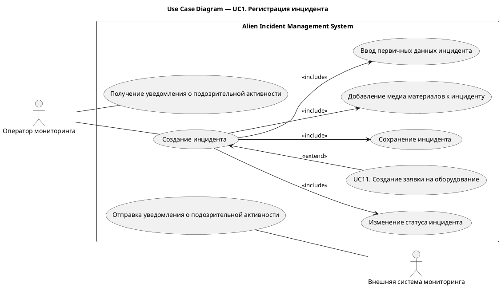
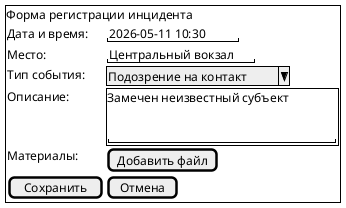
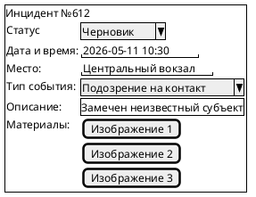

# UC1. Регистрация инцидента

## 1.Use-Case Name (Название прецедента)

UC1. Регистрация инцидента.

Связанные требования: 3.1.1.1, 3.1.1.2, 3.1.3.1.

## 2.Actors (Акторы)

Основное действующее лицо: Оператор мониторинга.

Второстепенные действующие лица: Внешняя система мониторинга.

## 2. Brief Description (Краткое описание)

Оператор мониторинга получает информацию о возможной инопланетной активности из внешних источников наблюдения и
регистрирует новый инцидент в системе для последующей аналитической обработки.

## 3. Flow of Events (Последовательность событий)

### 3.1 Basic Flow (Главная последовательность)

1. Внешняя система мониторинга фиксирует подозрительную активность.
2. Оператор мониторинга получает уведомление о выявленной активности.
3. Оператор анализирует поступившие материалы и принимает решение о необходимости регистрации инцидента.
4. Оператор инициирует создание нового инцидента.
5. Система отображает форму регистрации инцидента.
6. Оператор указывает основные сведения об инциденте: место происшествия; время обнаружения; тип инцидента; краткое
   описание.
7. Оператор прикрепляет доступные материалы к инциденту: изображения; видео.
8. Оператор инициирует сохранение инцидента.
9. Система выполняет проверку корректности введенных данных.
10. Система сохраняет инцидент в базе данных.
11. Система фиксирует запись в истории изменений инцидента.
12. Точка расширения: [создание заявки на оборудование (UC11)](UC11.md).
13. Оператор переводит инцидент в статус «Готов к анализу».
14. Система уведомляет аналитиков о появлении нового инцидента.

### 3.2 Alternative Flows (Альтернативные последовательности)

Введены некорректные данные

1. Альтернативный поток начинается после шага 9 основного потока.
2. Система обнаруживает ошибки заполнения.
3. Система уведомляет пользователя о некорректных указанных данных.
4. Оператор исправляет данные.
5. Выполнение возвращается к шагу 9 основной последовательности.

## 4. Preconditions (Предусловия)

1. Пользователь авторизован в системе.
2. Пользователь имеет роль Оператор мониторинга.
3. Получено сообщение о подозрительной активности из внешнего источника наблюдения.

## 5. Postconditions (Постусловия)

1. В системе зарегистрирован новый инцидент.
2. Для инцидента определено время и место обнаружения.
3. Инцидент содержит приложенные материалы.
4. Инцидент имеет статус «Готов к анализу».
5. История создания и изменения инцидента зафиксирована.
6. Аналитики уведомлены о необходимости обработки инцидента.

## 6. Extension Points (Точки расширения)

[UC11 Создание заявки на оборудование](UC11.md).

## 7. Use-case diagram (Диаграмма прецедента)

## 8. Interface example (Пример интерефейса)

```plantuml
@startsalt
{ 
    Статус | ^Черновик       ^^ Готов к анализу ^
}
@endsalt
```

