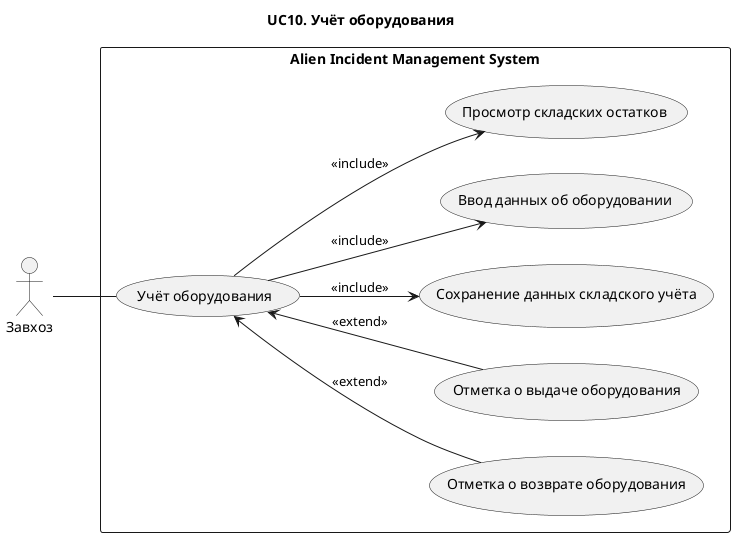

# UC10. Учёт оборудования

## Диаграмма прецедента

```plantuml
@startuml
title UC10. Учёт оборудования
left to right direction

actor "Завхоз" as Storekeeper

rectangle "Alien Incident Management System" {

(Учёт оборудования) as UC11

(Отметка о возврате оборудования) as UC116
(Отметка о выдаче оборудования) as UC115
(Сохранение данных складского учёта) as UC114
(Ввод данных об оборудовании) as UC112
(Просмотр складских остатков) as UC111

}

Storekeeper -- UC11

UC11 --> UC111 : <<include>>
UC11 --> UC112 : <<include>>
UC11 --> UC114 : <<include>>
UC11 <-- UC115 : <<extend>>
UC11 <-- UC116 : <<extend>>

@enduml
```
