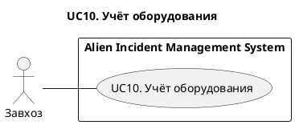

# UC10. Учёт оборудования

```plantuml
@startuml
title UC10. Учёт оборудования
left to right direction

actor "Завхоз" as Storekeeper

rectangle "Alien Incident Management System" {
  usecase "UC10. Учёт оборудования" as UC10
}

Storekeeper -- UC10

@enduml
```
