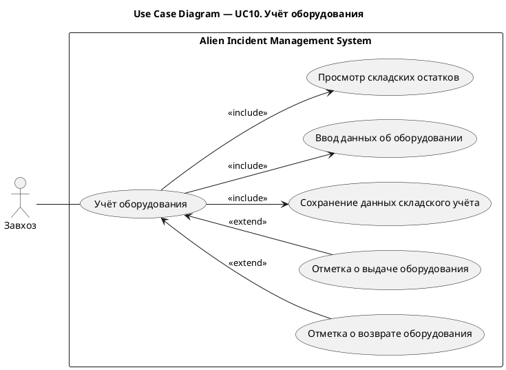
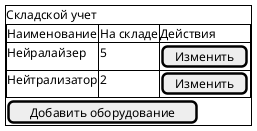
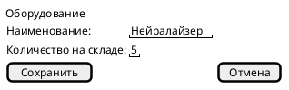
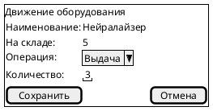

# UC10. Учёт оборудования

## 1.Use-Case Name (Название прецедента)

UC10. Учёт оборудования.

Связанные требования: 3.1.3.3.

## 2.Actors (Акторы)

Основное действующее лицо: Завхоз.

## 2. Brief Description (Краткое описание)

Завхоз просматривает складские остатки, вносит данные о наименовании и количестве оборудования, фиксирует его выдачу и
возврат и сохраняет изменения для поддержания актуального складского учета.

## 3. Flow of Events (Последовательность событий)

### 3.1 Basic Flow (Главная последовательность)

1. Завхоз открывает сведения о складских остатках оборудования.
2. Система отображает наименования оборудования и доступное количество.
3. Завхоз указывает или уточняет наименование и количество оборудования.
4. Завхоз инициирует сохранение данных складского учета.
5. Система выполняет проверку корректности введенных данных.
6. Система сохраняет данные складского учета.
7. Система отображает обновленные складские остатки.

### 3.2 Alternative Flows (Альтернативные последовательности)

Отметка о выдаче оборудования

1. Альтернативный поток начинается после шага 2 основного потока.
2. Завхоз выбирает оборудование и указывает количество выданного оборудования.
3. Система проверяет, что указанное количество не превышает доступный остаток.
4. Система уменьшает складской остаток на выданное количество и сохраняет данные о выдаче.
5. Выполнение продолжается с шага 7 основной последовательности.

Отметка о возврате оборудования

1. Альтернативный поток начинается после шага 2 основного потока.
2. Завхоз выбирает оборудование и указывает количество возвращенного оборудования.
3. Система проверяет корректность введенных данных.
4. Система увеличивает складской остаток на возвращенное количество и сохраняет данные о возврате.
5. Выполнение продолжается с шага 7 основной последовательности.

Введены некорректные данные

1. Альтернативный поток начинается при проверке данных основного потока или отметки о выдаче либо возврате.
2. Система обнаруживает ошибки и сообщает о них завхозу, не сохраняя изменения складских остатков.
3. Завхоз исправляет данные.
4. Выполнение возвращается к проверке исправленных данных.

## 4. Preconditions (Предусловия)

1. Пользователь авторизован в системе.
2. Пользователь имеет роль Завхоз.
3. Завхоз располагает сведениями о количестве оборудования или выполненной выдаче либо возврате.

## 5. Postconditions (Постусловия)

1. Данные складского учета сохранены.
2. При выдаче или возврате оборудования остатки изменены на указанное количество.
3. Завхозу доступны обновленные сведения о складских остатках.

## 6. Extension Points (Точки расширения)

Отсутствуют.

## 7. Use-case diagram (Диаграмма прецедента)

## 8. Interface example (Пример интерефейса)

```plantuml
@startsalt
{
    Операция: | ^Выдача       ^^ Возврат ^
    .
    .
}
@endsalt
```

