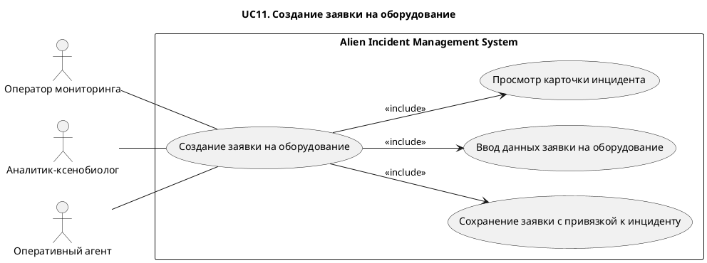

# UC11. Создание заявки на оборудование

## Диаграмма прецедента

```plantuml
@startuml
title UC11. Создание заявки на оборудование
left to right direction

actor "Оператор мониторинга" as Operator
actor "Аналитик-ксенобиолог" as Analyst
actor "Оперативный агент" as Agent

rectangle "Alien Incident Management System" {

(Создание заявки на оборудование) as UC11

(Сохранение заявки с привязкой к инциденту) as UC115
(Ввод данных заявки на оборудование) as UC112
(Просмотр карточки инцидента) as UC111

}

Operator -- UC11
Analyst -- UC11
Agent -- UC11

UC11 --> UC111 : <<include>>
UC11 --> UC112 : <<include>>
UC11 --> UC115 : <<include>>

@enduml
```
