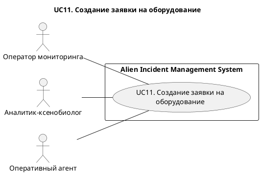

# UC11. Создание заявки на оборудование

```plantuml
@startuml
title UC11. Создание заявки на оборудование
left to right direction

actor "Оператор мониторинга" as Operator
actor "Аналитик-ксенобиолог" as Analyst
actor "Оперативный агент" as Agent

rectangle "Alien Incident Management System" {
  usecase "UC11. Создание заявки на\nоборудование" as UC11
}

Operator -- UC11
Analyst -- UC11
Agent -- UC11

@enduml
```
