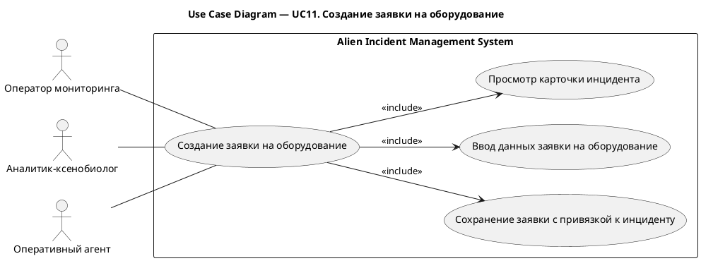
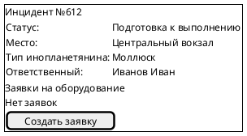
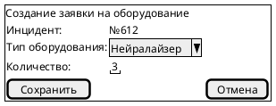

# UC11. Создание заявки на оборудование

## 1.Use-Case Name (Название прецедента)

UC11. Создание заявки на оборудование.

Связанные требования: 3.1.3.1.

## 2.Actors (Акторы)

Основные действующие лица: Оператор мониторинга, Аналитик-ксенобиолог, Оперативный агент.

## 2. Brief Description (Краткое описание)

Оператор мониторинга, аналитик-ксенобиолог или оперативный агент при возникновении потребности в оборудовании
открывает карточку инцидента, указывает тип оборудования и необходимое количество и сохраняет заявку с привязкой к
инциденту.

## 3. Flow of Events (Последовательность событий)

### 3.1 Basic Flow (Главная последовательность)

1. Оператор мониторинга, аналитик-ксенобиолог или оперативный агент определяет потребность в оборудовании.
2. Пользователь открывает карточку инцидента.
3. Пользователь инициирует создание заявки на оборудование.
4. Система отображает форму создания заявки.
5. Пользователь указывает тип оборудования и необходимое количество.
6. Пользователь инициирует сохранение заявки.
7. Система выполняет проверку корректности введенных данных.
8. Система сохраняет заявку в статусе «Новая» с привязкой к инциденту и указанием автора и времени создания.
9. Система отображает созданную заявку в списке заявок инцидента.

### 3.2 Alternative Flows (Альтернативные последовательности)

Введены некорректные данные

1. Альтернативный поток начинается после шага 7 основного потока.
2. Система обнаруживает ошибки заполнения и сообщает о них пользователю.
3. Пользователь исправляет данные.
4. Выполнение возвращается к шагу 6 основной последовательности.

## 4. Preconditions (Предусловия)

1. Пользователь авторизован в системе.
2. Пользователь имеет роль Оператор мониторинга, Аналитик-ксенобиолог или Оперативный агент.
3. В системе существует инцидент, для которого требуется оборудование.
4. Инцидент не завершен и доступен пользователю для изменения.

## 5. Postconditions (Постусловия)

1. Создана заявка на оборудование в статусе «Новая».
2. Заявка содержит тип оборудования, необходимое количество, автора и время создания.
3. Заявка связана с инцидентом и доступна завхозу для обработки.

## 6. Extension Points (Точки расширения)

Отсутствуют.

## 7. Use-case diagram (Диаграмма прецедента)

## 8. Interface example (Пример интерефейса)

