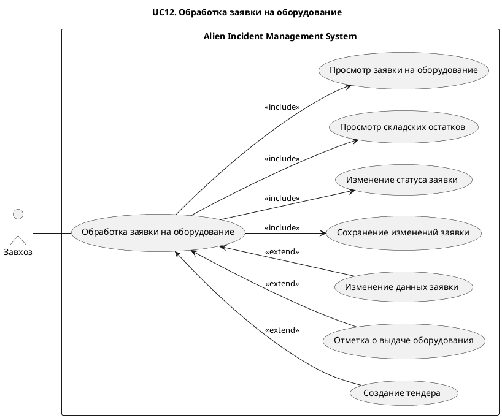

# UC12. Обработка заявки на оборудование

## Диаграмма прецедента

```plantuml
@startuml
title UC12. Обработка заявки на оборудование
left to right direction

actor "Завхоз" as Storekeeper

rectangle "Alien Incident Management System" {

(Обработка заявки на оборудование) as UC11

(Создание тендера) as UC118
(Отметка о выдаче оборудования) as UC116
(Изменение данных заявки) as UC115
(Сохранение изменений заявки) as UC114
(Изменение статуса заявки) as UC113
(Просмотр складских остатков) as UC112
(Просмотр заявки на оборудование) as UC111

}

Storekeeper -- UC11

UC11 --> UC111 : <<include>>
UC11 --> UC112 : <<include>>
UC11 --> UC113 : <<include>>
UC11 --> UC114 : <<include>>
UC11 <-- UC115 : <<extend>>
UC11 <-- UC116 : <<extend>>
UC11 <-- UC118 : <<extend>>

@enduml
```
