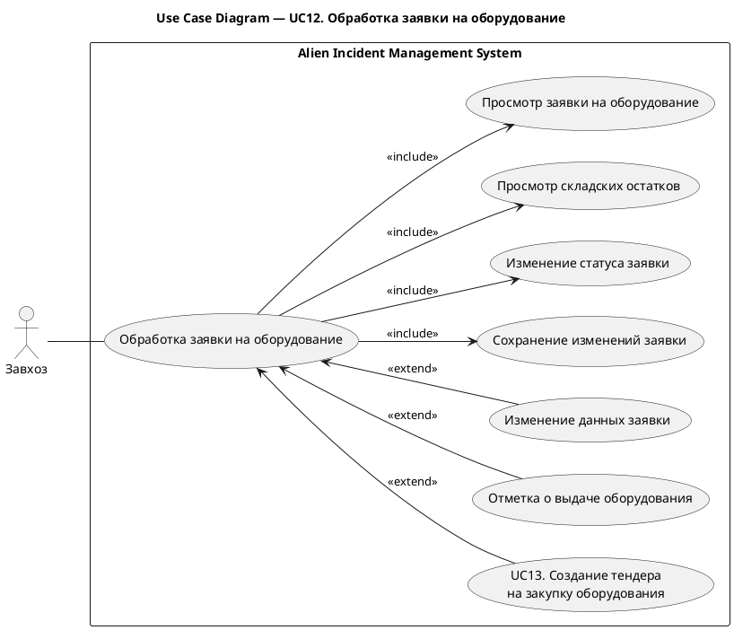
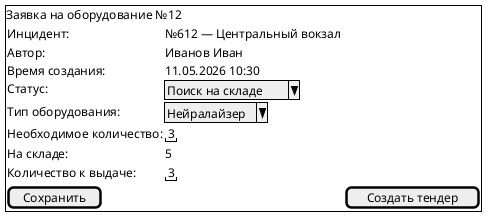

# UC12. Обработка заявки на оборудование

## 1.Use-Case Name (Название прецедента)

UC12. Обработка заявки на оборудование.

Связанные требования: 3.1.3.2, 3.1.3.3, 3.1.4.1.

## 2.Actors (Акторы)

Основное действующее лицо: Завхоз.

## 2. Brief Description (Краткое описание)

Завхоз получает заявку на оборудование, оценивает возможность ее выполнения по складским остаткам и фиксирует
результаты обработки. При выдаче оборудования завхоз фиксирует выдачу, а при его нехватке инициирует создание тендера
на закупку.

## 3. Flow of Events (Последовательность событий)

### 3.1 Basic Flow (Главная последовательность)

1. Завхоз открывает заявку на оборудование в статусе «Новая».
2. Система отображает данные заявки и связанный инцидент.
3. Завхоз принимает заявку в обработку, изменяя ее статус на «Поиск на складе».
4. Система сохраняет изменения заявки.
5. Завхоз просматривает складские остатки необходимого оборудования.
6. Завхоз определяет, что на складе имеется необходимое количество оборудования.
7. Завхоз выдает оборудование и указывает выданное количество.
8. Завхоз изменяет статус заявки на «Выдана» и инициирует сохранение.
9. Система сохраняет изменения заявки и отметку о выдаче, уменьшает складской остаток на выданное количество.
10. Система отображает результат обработки заявки.

### 3.2 Alternative Flows (Альтернативные последовательности)

Недостаточно оборудования на складе

1. Альтернативный поток начинается после шага 5 основного потока.
2. Завхоз определяет, что складских остатков недостаточно для выполнения заявки.
3. Точка расширения: [создание тендера на закупку оборудования (UC13)](UC13.md).
4. Заявка остается незавершенной до обеспечения необходимым оборудованием.
5. После поступления оборудования обработка продолжается с шага 5 основной последовательности.

Изменение данных заявки

1. Альтернативный поток начинается после шага 5 основного потока.
2. Завхоз уточняет тип оборудования или необходимое количество.
3. Завхоз инициирует сохранение изменений.
4. Система проверяет корректность данных и сохраняет изменения заявки.
5. Выполнение продолжается с шага 5 основной последовательности.

Введены некорректные данные

1. Альтернативный поток начинается при изменении данных заявки или указании выданного количества.
2. Система обнаруживает некорректные данные, в том числе превышение доступного складского остатка при выдаче.
3. Система сообщает об ошибке и не сохраняет некорректные изменения.
4. Завхоз исправляет данные и повторяет сохранение.

## 4. Preconditions (Предусловия)

1. Пользователь авторизован в системе.
2. Пользователь имеет роль Завхоз.
3. В системе существует незавершенная заявка на оборудование, связанная с инцидентом.
4. Инцидент не завершен.

## 5. Postconditions (Постусловия)

1. Результат обработки заявки сохранен.
2. При выдаче оборудования заявка находится в статусе «Выдана», выдача зафиксирована, а складской остаток уменьшен
   на выданное количество.
3. При нехватке оборудования создан тендер на закупку, заявка ожидает обеспечения оборудованием.
4. Заявка остается незавершенной до возврата оборудования на склад.

## 6. Extension Points (Точки расширения)

[UC13. Создание тендера на закупку оборудования](UC13.md) — после шага 5 основной последовательности
при нехватке оборудования.

## 7. Use-case diagram (Диаграмма прецедента)

## 8. Interface example (Пример интерефейса)

```plantuml
@startsalt
{
    Статус: | ^Новая       ^^ Поиск на складе ^^ Выдана ^
    .
    .
    .
}
@endsalt
```

