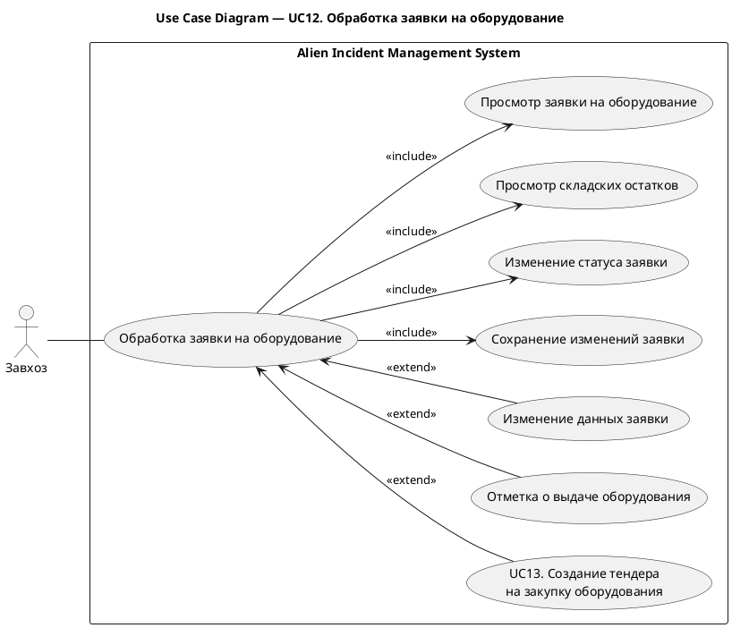

# UC12. Обработка заявки на оборудование

## 1.Use-Case Name (Название прецедента)

UC12. Обработка заявки на оборудование.

Связанные требования: 3.1.3.2, 3.1.3.3, 3.1.4.1.

## 2.Actors (Акторы)

Основное действующее лицо: Завхоз.

## 2. Brief Description (Краткое описание)

Завхоз получает заявку на оборудование, оценивает возможность ее выполнения по складским остаткам и фиксирует
результаты обработки. При выдаче оборудования завхоз фиксирует выдачу, а при его нехватке инициирует создание тендера
на закупку.

## 3. Flow of Events (Последовательность событий)

### 3.1 Basic Flow (Главная последовательность)

TBD

### 3.2 Alternative Flows (Альтернативные последовательности)

TBD

## 4. Preconditions (Предусловия)

TBD

## 5. Postconditions (Постусловия)

TBD

## 6. Extension Points (Точки расширения)

TBD

## 7. Use-case diagram (Диаграмма прецедента)

## 8. Interface example (Пример интерефейса)

TBD
