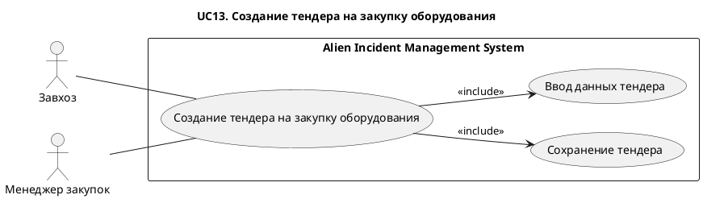

# UC13. Создание тендера на закупку оборудования

## Диаграмма прецедента

```plantuml
@startuml
title UC13. Создание тендера на закупку оборудования
left to right direction

actor "Завхоз" as Storekeeper
actor "Менеджер закупок" as Procurement

rectangle "Alien Incident Management System" {

(Создание тендера на закупку оборудования) as UC11

(Сохранение тендера) as UC114
(Ввод данных тендера) as UC111

}

Storekeeper -- UC11
Procurement -- UC11

UC11 --> UC111 : <<include>>
UC11 --> UC114 : <<include>>

@enduml
```
