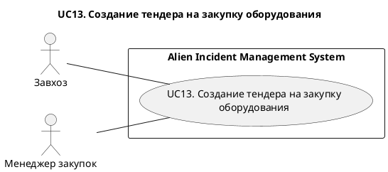

# UC13. Создание тендера на закупку оборудования

```plantuml
@startuml
title UC13. Создание тендера на закупку оборудования
left to right direction

actor "Завхоз" as Storekeeper
actor "Менеджер закупок" as Procurement

rectangle "Alien Incident Management System" {
  usecase "UC13. Создание тендера на закупку\nоборудования" as UC13
}

Storekeeper -- UC13
Procurement -- UC13

@enduml
```
