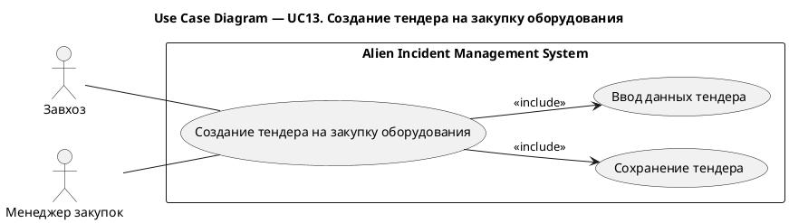
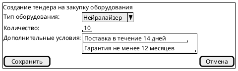

# UC13. Создание тендера на закупку оборудования

## 1.Use-Case Name (Название прецедента)

UC13. Создание тендера на закупку оборудования.

Связанные требования: 3.1.4.1.

## 2.Actors (Акторы)

Основные действующие лица: Завхоз, Менеджер закупок.

## 2. Brief Description (Краткое описание)

Завхоз или менеджер закупок при возникновении потребности в закупке оборудования инициирует создание тендера,
указывает тип оборудования, количество и дополнительные условия и сохраняет тендер для дальнейшей работы с
участниками.

## 3. Flow of Events (Последовательность событий)

### 3.1 Basic Flow (Главная последовательность)

1. Завхоз или менеджер закупок определяет потребность в закупке оборудования.
2. Пользователь инициирует создание тендера на закупку оборудования.
3. Система отображает форму создания тендера.
4. Пользователь указывает тип оборудования, необходимое количество и дополнительные условия закупки.
5. Пользователь инициирует сохранение тендера.
6. Система выполняет проверку корректности введенных данных.
7. Система сохраняет тендер.
8. Система отображает созданный тендер.

### 3.2 Alternative Flows (Альтернативные последовательности)

Введены некорректные данные

1. Альтернативный поток начинается после шага 6 основного потока.
2. Система обнаруживает ошибки заполнения и сообщает о них пользователю.
3. Пользователь исправляет данные.
4. Выполнение возвращается к шагу 5 основной последовательности.

## 4. Preconditions (Предусловия)

1. Пользователь авторизован в системе.
2. Пользователь имеет роль Завхоз или Менеджер закупок.
3. Определена потребность в закупке оборудования.

## 5. Postconditions (Постусловия)

1. В системе создан тендер на закупку оборудования.
2. Тендер содержит тип оборудования, необходимое количество и дополнительные условия закупки.
3. Тендер доступен менеджеру закупок для дальнейшей работы с участниками.

## 6. Extension Points (Точки расширения)

Отсутствуют.

## 7. Use-case diagram (Диаграмма прецедента)

## 8. Interface example (Пример интерефейса)

