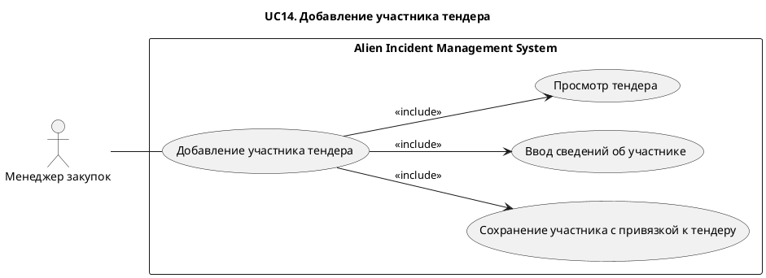

# UC14. Добавление участника тендера

## Диаграмма прецедента

```plantuml
@startuml
title UC14. Добавление участника тендера
left to right direction

actor "Менеджер закупок" as Procurement

rectangle "Alien Incident Management System" {

(Добавление участника тендера) as UC11

(Сохранение участника с привязкой к тендеру) as UC115
(Ввод сведений об участнике) as UC112
(Просмотр тендера) as UC111

}

Procurement -- UC11

UC11 --> UC111 : <<include>>
UC11 --> UC112 : <<include>>
UC11 --> UC115 : <<include>>

@enduml
```
