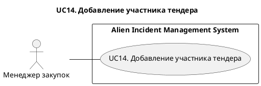

# UC14. Добавление участника тендера

```plantuml
@startuml
title UC14. Добавление участника тендера
left to right direction

actor "Менеджер закупок" as Procurement

rectangle "Alien Incident Management System" {
  usecase "UC14. Добавление участника тендера" as UC14
}

Procurement -- UC14

@enduml
```
