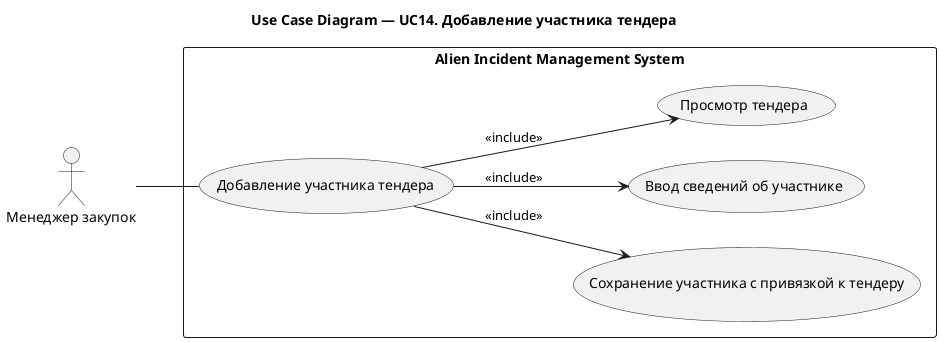
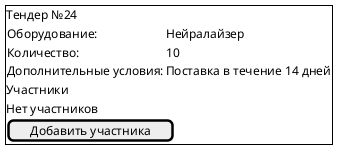
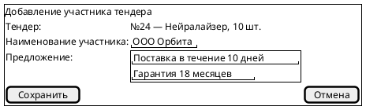

# UC14. Добавление участника тендера

## 1.Use-Case Name (Название прецедента)

UC14. Добавление участника тендера.

Связанные требования: 3.1.4.2.

## 2.Actors (Акторы)

Основное действующее лицо: Менеджер закупок.

## 2. Brief Description (Краткое описание)

Менеджер закупок открывает тендер на закупку оборудования, вносит сведения об участнике и сохраняет его с привязкой к
тендеру для последующего выбора победителя.

## 3. Flow of Events (Последовательность событий)

### 3.1 Basic Flow (Главная последовательность)

1. Менеджер закупок открывает тендер на закупку оборудования.
2. Система отображает сведения о тендере и список его участников.
3. Менеджер инициирует добавление участника тендера.
4. Система отображает форму добавления участника.
5. Менеджер указывает наименование участника и сведения о его предложении.
6. Менеджер инициирует сохранение участника.
7. Система выполняет проверку корректности введенных данных.
8. Система сохраняет участника с привязкой к тендеру.
9. Система отображает обновленный список участников.

### 3.2 Alternative Flows (Альтернативные последовательности)

Введены некорректные данные

1. Альтернативный поток начинается после шага 7 основного потока.
2. Система обнаруживает ошибки заполнения и сообщает о них менеджеру.
3. Менеджер исправляет данные.
4. Выполнение возвращается к шагу 6 основной последовательности.

## 4. Preconditions (Предусловия)

1. Пользователь авторизован в системе.
2. Пользователь имеет роль Менеджер закупок.
3. Менеджер располагает сведениями об участнике и его предложении.

## 5. Postconditions (Постусловия)

1. Участник добавлен к тендеру.
2. Наименование участника и сведения о его предложении сохранены.
3. Участник доступен для рассмотрения при выборе победителя.

## 6. Extension Points (Точки расширения)

Отсутствуют.

## 7. Use-case diagram (Диаграмма прецедента)

## 8. Interface example (Пример интерефейса)

