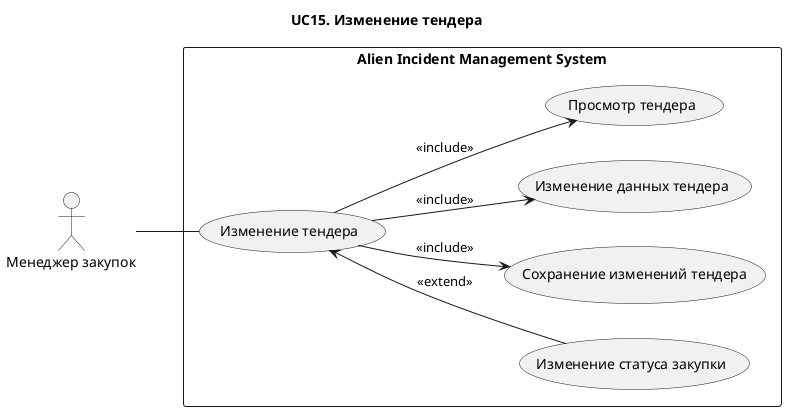

# UC15. Изменение тендера

## Диаграмма прецедента

```plantuml
@startuml
title UC15. Изменение тендера
left to right direction

actor "Менеджер закупок" as Procurement

rectangle "Alien Incident Management System" {

(Изменение тендера) as UC11

(Изменение статуса закупки) as UC115
(Сохранение изменений тендера) as UC114
(Изменение данных тендера) as UC112
(Просмотр тендера) as UC111

}

Procurement -- UC11

UC11 --> UC111 : <<include>>
UC11 --> UC112 : <<include>>
UC11 --> UC114 : <<include>>
UC11 <-- UC115 : <<extend>>

@enduml
```
