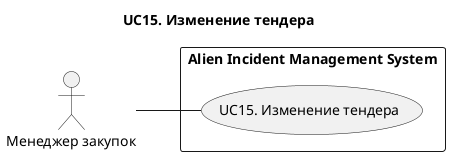

# UC15. Изменение тендера

```plantuml
@startuml
title UC15. Изменение тендера
left to right direction

actor "Менеджер закупок" as Procurement

rectangle "Alien Incident Management System" {
  usecase "UC15. Изменение тендера" as UC15
}

Procurement -- UC15

@enduml
```
