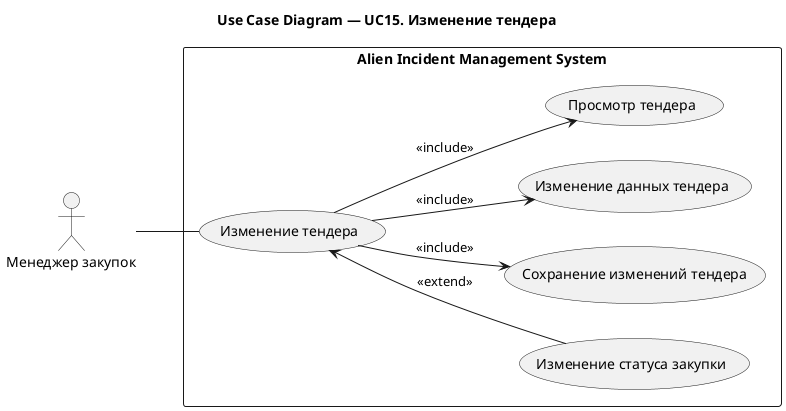
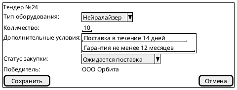
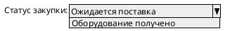

# UC15. Изменение тендера

## 1.Use-Case Name (Название прецедента)

UC15. Изменение тендера.

Связанные требования: 3.1.4.4.

## 2.Actors (Акторы)

Основное действующее лицо: Менеджер закупок.

## 2. Brief Description (Краткое описание)

Менеджер закупок при необходимости уточнения условий или отражения хода закупки обновляет сведения о тендере и
сохраняет изменения.

## 3. Flow of Events (Последовательность событий)

### 3.1 Basic Flow (Главная последовательность)

1. Менеджер закупок открывает тендер на закупку оборудования.
2. Система отображает данные тендера.
3. Менеджер изменяет тип оборудования, необходимое количество или дополнительные условия закупки.
4. Менеджер инициирует сохранение изменений.
5. Система выполняет проверку корректности введенных данных.
6. Система сохраняет изменения тендера.
7. Система отображает обновленные данные тендера.

### 3.2 Alternative Flows (Альтернативные последовательности)

Изменение статуса закупки

1. Альтернативный поток начинается после шага 2 основного потока.
2. Менеджер изменяет статус закупки в соответствии с ходом ее выполнения, в том числе отмечает получение оборудования.
3. Выполнение продолжается с шага 4 основной последовательности.

Введены некорректные данные

1. Альтернативный поток начинается после шага 5 основного потока.
2. Система обнаруживает ошибки заполнения и сообщает о них менеджеру.
3. Менеджер исправляет данные.
4. Выполнение возвращается к шагу 4 основной последовательности.

## 4. Preconditions (Предусловия)

1. Пользователь авторизован в системе.
2. Пользователь имеет роль Менеджер закупок.
3. Возникла необходимость уточнения данных тендера или отражения хода закупки.

## 5. Postconditions (Постусловия)

1. Изменения тендера сохранены.
2. При изменении статуса закупки сохранен ее актуальный статус.
3. Менеджеру доступны обновленные сведения о тендере.

## 6. Extension Points (Точки расширения)

Отсутствуют.

## 7. Use-case diagram (Диаграмма прецедента)

## 8. Interface example (Пример интерефейса)

