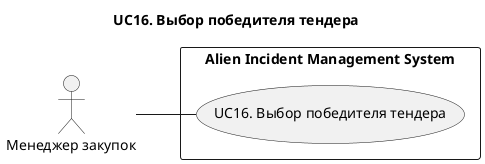

# UC16. Выбор победителя тендера

```plantuml
@startuml
title UC16. Выбор победителя тендера
left to right direction

actor "Менеджер закупок" as Procurement

rectangle "Alien Incident Management System" {
  usecase "UC16. Выбор победителя тендера" as UC16
}

Procurement -- UC16

@enduml
```
