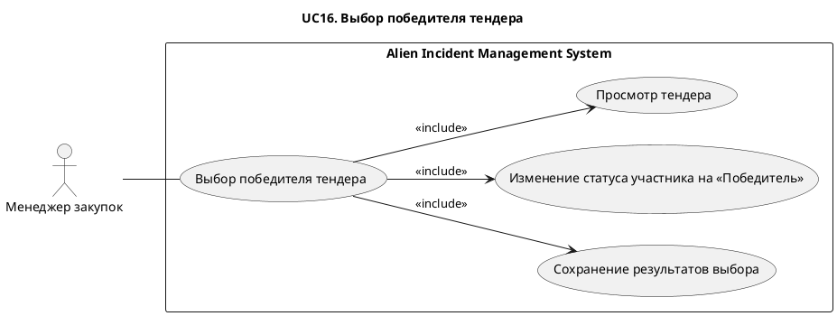

# UC16. Выбор победителя тендера

## Диаграмма прецедента

```plantuml
@startuml
title UC16. Выбор победителя тендера
left to right direction

actor "Менеджер закупок" as Procurement

rectangle "Alien Incident Management System" {

(Выбор победителя тендера) as UC11

(Сохранение результатов выбора) as UC115
(Изменение статуса участника на «Победитель») as UC114
(Просмотр тендера) as UC111

}

Procurement -- UC11

UC11 --> UC111 : <<include>>
UC11 --> UC114 : <<include>>
UC11 --> UC115 : <<include>>

@enduml
```
