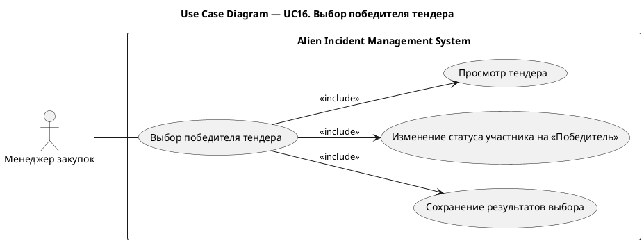
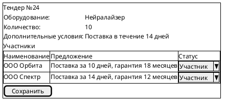
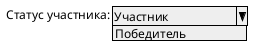

# UC16. Выбор победителя тендера

## 1.Use-Case Name (Название прецедента)

UC16. Выбор победителя тендера.

Связанные требования: 3.1.4.3.

## 2.Actors (Акторы)

Основное действующее лицо: Менеджер закупок.

## 2. Brief Description (Краткое описание)

Менеджер закупок рассматривает добавленных участников тендера на закупку оборудования, выбирает победителя и фиксирует
результат выбора в системе.

## 3. Flow of Events (Последовательность событий)

### 3.1 Basic Flow (Главная последовательность)

1. Менеджер закупок открывает тендер на закупку оборудования.
2. Система отображает сведения о тендере, его участниках и их предложениях.
3. Менеджер рассматривает предложения и выбирает победителя тендера.
4. Менеджер изменяет статус выбранного участника на «Победитель».
5. Менеджер инициирует сохранение результата выбора.
6. Система выполняет проверку корректности введенных данных.
7. Система сохраняет результат выбора.
8. Система отображает участников тендера с указанием победителя.

### 3.2 Alternative Flows (Альтернативные последовательности)

Введены некорректные данные

1. Альтернативный поток начинается после шага 6 основного потока.
2. Система обнаруживает ошибки заполнения и сообщает о них менеджеру.
3. Менеджер исправляет данные.
4. Выполнение возвращается к шагу 5 основной последовательности.

## 4. Preconditions (Предусловия)

1. Пользователь авторизован в системе.
2. Пользователь имеет роль Менеджер закупок.
3. К тендеру добавлен хотя бы один участник с предложением.

## 5. Postconditions (Постусловия)

1. У тендера определен победитель.
2. Выбранному участнику присвоен статус «Победитель».
3. Результат выбора сохранен и отображается в сведениях о тендере.

## 6. Extension Points (Точки расширения)

Отсутствуют.

## 7. Use-case diagram (Диаграмма прецедента)

## 8. Interface example (Пример интерефейса)

```plantuml
@startsalt
{+
    Тендер №24
    {
        Оборудование: | Нейралайзер
        Количество: | 10
        Победитель: | ООО Орбита
    }
    {#
        Наименование | Статус
        ООО Орбита | Победитель
        ООО Спектр | Участник
    }
}
@endsalt
```

