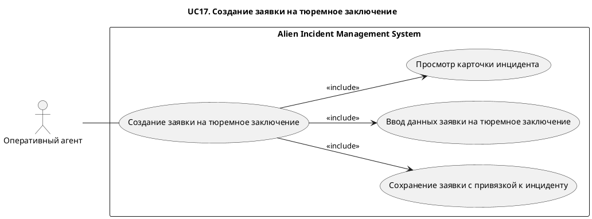

# UC17. Создание заявки на тюремное заключение

## Диаграмма прецедента

```plantuml
@startuml
title UC17. Создание заявки на тюремное заключение
left to right direction

actor "Оперативный агент" as Agent

rectangle "Alien Incident Management System" {

(Создание заявки на тюремное заключение) as UC11

(Сохранение заявки с привязкой к инциденту) as UC115
(Ввод данных заявки на тюремное заключение) as UC112
(Просмотр карточки инцидента) as UC111

}

Agent -- UC11

UC11 --> UC111 : <<include>>
UC11 --> UC112 : <<include>>
UC11 --> UC115 : <<include>>

@enduml
```
