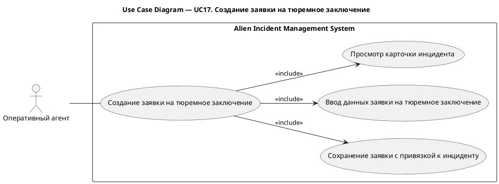
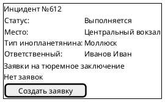
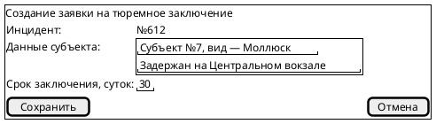

# UC17. Создание заявки на тюремное заключение

## 1.Use-Case Name (Название прецедента)

UC17. Создание заявки на тюремное заключение.

Связанные требования: 3.1.5.1.

## 2.Actors (Акторы)

Основное действующее лицо: Оперативный агент.

## 2. Brief Description (Краткое описание)

Оперативный агент при необходимости заключения субъекта под стражу открывает карточку инцидента, указывает данные
субъекта и срок заключения и сохраняет заявку на тюремное заключение с привязкой к инциденту.

## 3. Flow of Events (Последовательность событий)

### 3.1 Basic Flow (Главная последовательность)

1. Оперативный агент определяет необходимость заключения субъекта под стражу.
2. Агент открывает карточку инцидента.
3. Агент инициирует создание заявки на тюремное заключение.
4. Система отображает форму создания заявки.
5. Агент указывает данные субъекта и срок заключения.
6. Агент инициирует сохранение заявки.
7. Система выполняет проверку корректности введенных данных.
8. Система сохраняет заявку в статусе «Новая» с привязкой к инциденту и указанием автора и времени создания.
9. Система отображает созданную заявку в списке заявок инцидента.

### 3.2 Alternative Flows (Альтернативные последовательности)

Введены некорректные данные

1. Альтернативный поток начинается после шага 7 основного потока.
2. Система обнаруживает ошибки заполнения и сообщает о них агенту.
3. Агент исправляет данные.
4. Выполнение возвращается к шагу 6 основной последовательности.

## 4. Preconditions (Предусловия)

1. Пользователь авторизован в системе.
2. Пользователь имеет роль Оперативный агент.
3. Инцидент не завершен.
4. Агент располагает данными субъекта и сведениями о сроке заключения.

## 5. Postconditions (Постусловия)

1. Создана заявка на тюремное заключение в статусе «Новая».
2. Заявка содержит данные субъекта, срок заключения, автора и время создания.
3. Заявка связана с инцидентом и доступна тюремному надзирателю для обработки.

## 6. Extension Points (Точки расширения)

Отсутствуют.

## 7. Use-case diagram (Диаграмма прецедента)

## 8. Interface example (Пример интерефейса)

