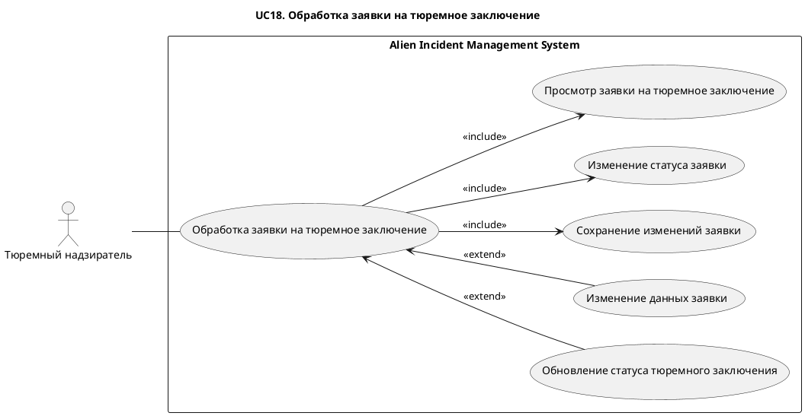

# UC18. Обработка заявки на тюремное заключение

## Диаграмма прецедента

```plantuml
@startuml
title UC18. Обработка заявки на тюремное заключение
left to right direction

actor "Тюремный надзиратель" as Guard

rectangle "Alien Incident Management System" {

(Обработка заявки на тюремное заключение) as UC11

(Обновление статуса тюремного заключения) as UC116
(Изменение данных заявки) as UC115
(Сохранение изменений заявки) as UC114
(Изменение статуса заявки) as UC113
(Просмотр заявки на тюремное заключение) as UC111

}

Guard -- UC11

UC11 --> UC111 : <<include>>
UC11 --> UC113 : <<include>>
UC11 --> UC114 : <<include>>
UC11 <-- UC115 : <<extend>>
UC11 <-- UC116 : <<extend>>

@enduml
```
