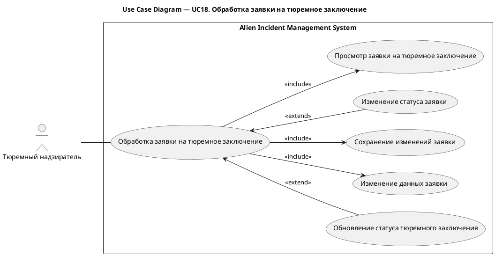
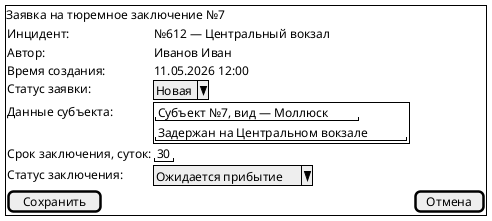
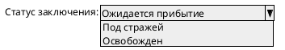

# UC18. Обработка заявки на тюремное заключение

## 1.Use-Case Name (Название прецедента)

UC18. Обработка заявки на тюремное заключение.

Связанные требования: 3.1.5.2.

## 2.Actors (Акторы)

Основное действующее лицо: Тюремный надзиратель.

## 2. Brief Description (Краткое описание)

Тюремный надзиратель при необходимости уточнения сведений о субъекте или сроке заключения изменяет заявку и
сохраняет изменения. В ходе обработки заявки и содержания субъекта надзиратель отражает результаты этих процессов.

## 3. Flow of Events (Последовательность событий)

### 3.1 Basic Flow (Главная последовательность)

1. Тюремный надзиратель открывает заявку на тюремное заключение.
2. Система отображает данные заявки, сведения о субъекте и связанный инцидент.
3. Надзиратель изменяет данные субъекта или срок заключения.
4. Надзиратель инициирует сохранение изменений.
5. Система выполняет проверку корректности введенных данных.
6. Система сохраняет изменения заявки.
7. Система отображает обновленные данные заявки.

### 3.2 Alternative Flows (Альтернативные последовательности)

Изменение статуса заявки

1. Альтернативный поток начинается после шага 2 основного потока.
2. Надзиратель изменяет статус заявки в соответствии с результатом ее рассмотрения.
3. Выполнение продолжается с шага 4 основной последовательности.

Обновление статуса тюремного заключения

1. Альтернативный поток начинается после шага 2 основного потока для принятой заявки.
2. Надзиратель изменяет статус заключения в соответствии с фактическим содержанием субъекта.
3. Выполнение продолжается с шага 4 основной последовательности.

Введены некорректные данные

1. Альтернативный поток начинается после шага 5 основного потока.
2. Система обнаруживает ошибки заполнения и сообщает о них надзирателю.
3. Надзиратель исправляет данные.
4. Выполнение возвращается к шагу 4 основной последовательности.

## 4. Preconditions (Предусловия)

1. Пользователь авторизован в системе.
2. Пользователь имеет роль Тюремный надзиратель.
3. Надзиратель располагает сведениями для рассмотрения заявки или обновления данных о заключении.

## 5. Postconditions (Постусловия)

1. Изменения заявки на тюремное заключение сохранены.
2. При уточнении данных субъекта или срока заключения сохранены обновленные сведения.
3. При изменении статуса заявки сохранен ее актуальный статус.
4. При изменении статуса заключения сохранен его актуальный статус.

## 6. Extension Points (Точки расширения)

Отсутствуют.

## 7. Use-case diagram (Диаграмма прецедента)

## 8. Interface example (Пример интерефейса)

```plantuml
@startsalt
{
    Статус заявки: | ^Новая       ^^ Принята ^
    .
    .
}
@endsalt
```

