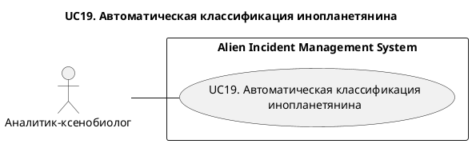

# UC19. Автоматическая классификация инопланетянина

```plantuml
@startuml
title UC19. Автоматическая классификация инопланетянина
left to right direction

actor "Аналитик-ксенобиолог" as Analyst

rectangle "Alien Incident Management System" {
  usecase "UC19. Автоматическая классификация\nинопланетянина" as UC19
}

Analyst -- UC19

@enduml
```
