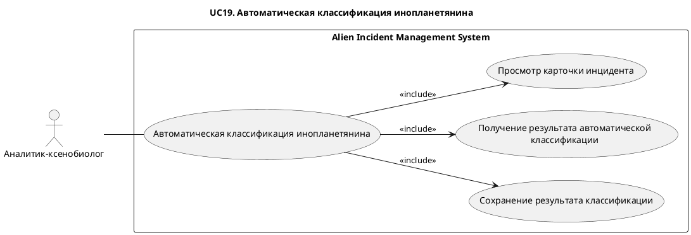

# UC19. Автоматическая классификация инопланетянина

## Диаграмма прецедента

```plantuml
@startuml
title UC19. Автоматическая классификация инопланетянина
left to right direction

actor "Аналитик-ксенобиолог" as Analyst

rectangle "Alien Incident Management System" {

(Автоматическая классификация инопланетянина) as UC11

(Сохранение результата классификации) as UC116
(Получение результата автоматической\nклассификации) as UC115
(Просмотр карточки инцидента) as UC111

}

Analyst -- UC11

UC11 --> UC111 : <<include>>
UC11 --> UC115 : <<include>>
UC11 --> UC116 : <<include>>

@enduml
```
