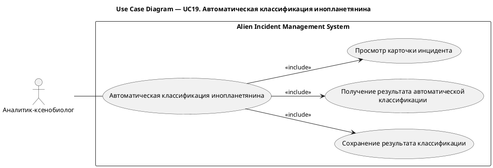
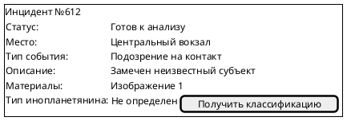
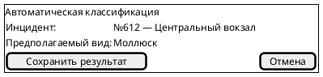

# UC19. Автоматическая классификация инопланетянина

## 1.Use-Case Name (Название прецедента)

UC19. Автоматическая классификация инопланетянина.

Связанные требования: 3.1.1.6.

## 2.Actors (Акторы)

Основное действующее лицо: Аналитик-ксенобиолог.

## 2. Brief Description (Краткое описание)

Аналитик-ксенобиолог открывает карточку инцидента, получает результат автоматической классификации инопланетянина на
основе загруженного изображения и сохраняет результат классификации в инциденте.

## 3. Flow of Events (Последовательность событий)

### 3.1 Basic Flow (Главная последовательность)

1. Аналитик-ксенобиолог открывает карточку инцидента.
2. Аналитик инициирует автоматическую классификацию инопланетянина.
3. Система определяет предполагаемый вид инопланетянина на основе изображения, прикрепленного к инциденту.
4. Система отображает результат классификации.
5. Аналитик просматривает предложенный результат и инициирует его сохранение.
6. Система сохраняет результат классификации в инциденте.
7. Система фиксирует запись в истории изменений инцидента.
8. Система отображает карточку инцидента с сохраненным результатом.

### 3.2 Alternative Flows (Альтернативные последовательности)

Не удалось определить вид инопланетянина

1. Альтернативный поток начинается после шага 3 основного потока.
2. Система сообщает, что автоматическая классификация не дала результата.
3. Выполнение прецедента завершается без изменения данных инцидента.

Аналитик не принимает предложенный результат

1. Альтернативный поток начинается после шага 4 основного потока.
2. Аналитик отказывается от сохранения предложенной классификации.
3. Выполнение прецедента завершается без изменения данных инцидента.

## 4. Preconditions (Предусловия)

1. Пользователь авторизован в системе.
2. Пользователь обладает ролью Аналитик-ксенобиолог.
3. Инцидент не завершен.
4. К инциденту прикреплено изображение инопланетянина.

## 5. Postconditions (Постусловия)

1. При сохранении результата инцидент содержит предложенную системой классификацию инопланетянина.
2. Сохранение результата зафиксировано в истории изменений инцидента.
3. Если результат не получен или не принят аналитиком, данные инцидента остаются без изменений.

## 6. Extension Points (Точки расширения)

Отсутствуют.

## 7. Use-case diagram (Диаграмма прецедента)

## 8. Interface example (Пример интерефейса)

