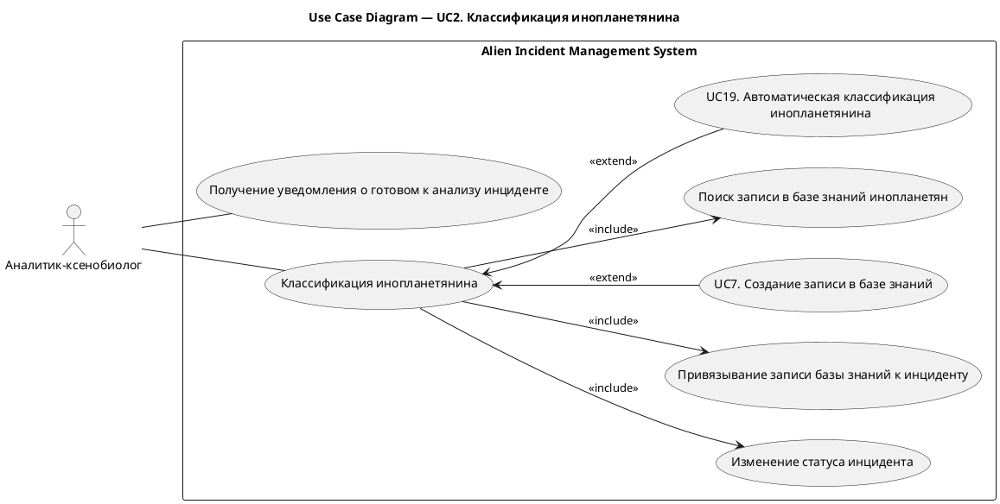
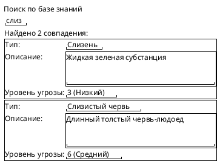
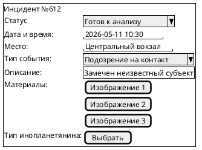
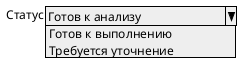

# UC2. Классификация инопланетянина

## 1.Use-Case Name (Название прецедента)

UC2. Классификации инопланетянина.

Связанные требования: 3.1.1.6, 3.1.2.1, 3.1.2.3, 3.1.2.4

## 2.Actors (Акторы)

Основное действующее лицо: Аналитик-ксенобиолог.

## 2. Brief Description (Краткое описание)

Аналитик-ксенобиолог получает уведомление о новом инциденте, анализирует материалы, сопоставляет инцидент с базой
знаний инопланетян, определяет тип инопланетного субъекта и переводит инцидент на следующий этап обработки.

## 3. Flow of Events (Последовательность событий)

### 3.1 Basic Flow (Главная последовательность)

1. Аналитик-ксенобиолог получает уведомление о новом инциденте в статусе «Готов к анализу».
2. Аналитик открывает карточку инцидента.
3. Аналитик изучает первичную информацию и прикрепленные материалы.
4. Точка расширения: [выполнение автоматической классификации инопланетянина (UC19)](UC19.md).
5. Аналитик инициирует поиск записи в базе знаний инопланетян.
6. Система отображает результаты поиска.
7. Точка расширения: [создание новой записи в базе знаний (UC7)](UC7.md).
8. Аналитик выбирает подходящую запись базы знаний.
9. Система привязывает запись базы знаний к инциденту.
10. Система сохраняет изменения.
11. Система фиксирует запись в истории изменений инцидента.
12. Аналитик изменяет статус инцидента на «Готов к выполнению».
13. Система уведомляет оперативных агентов о готовности инцидента к выполнению.

### 3.2 Alternative Flows (Альтернативные последовательности)

Недостаточно данных для классификации:

1. Альтернативный поток начинается после шага 3 основного потока.
2. Аналитик определяет, что приложенных материалов недостаточно.
3. Аналитик изменяет статус инцидента на «Требуется уточнение».
4. Аналитик добавляет комментарий с описанием недостающих данных.
5. Система уведомляет оператора мониторинга о необходимости уточнения.
6. Прецедент завершается.

## 4. Preconditions (Предусловия)

1. Пользователь авторизован в системе.
2. Пользователь обладает ролью Аналитик-ксенобиолог.
3. В системе существует инцидент в статусе «Готов к анализу».
4. Инцидент содержит первичные данные и материалы.

## 5. Postconditions (Постусловия)

1. Инцидент содержит информацию о классификации инопланетянина.
2. К инциденту привязана запись базы знаний.
3. Инцидент переведен в статус «Готов к выполнению» либо «Требуется уточнение».
4. История изменений инцидента обновлена.

## 6. Extension Points (Точки расширения)

[UC19 Выполнение автоматической классификации инопланетянина](UC19.md).

[UC7 Создание новой записи в базе знаний](UC7.md).

## 7. Use-case diagram (Диаграмма прецедента)

## 8. Interface example (Пример интерефейса)

