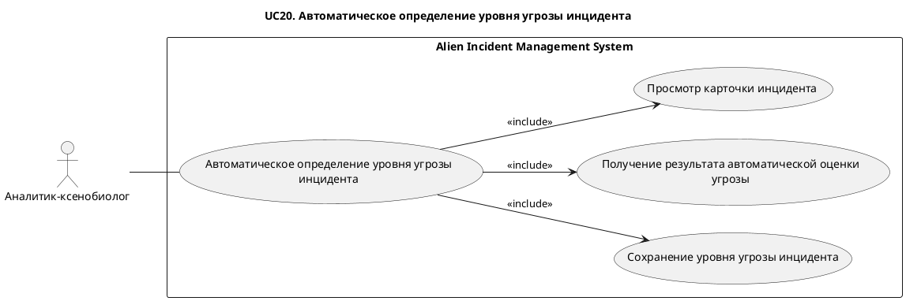

# UC20. Автоматическое определение уровня угрозы инцидента

## Диаграмма прецедента

```plantuml
@startuml
title UC20. Автоматическое определение уровня угрозы инцидента
left to right direction

actor "Аналитик-ксенобиолог" as Analyst

rectangle "Alien Incident Management System" {

(Автоматическое определение уровня угрозы\nинцидента) as UC11

(Сохранение уровня угрозы инцидента) as UC115
(Получение результата автоматической оценки\nугрозы) as UC114
(Просмотр карточки инцидента) as UC111

}

Analyst -- UC11

UC11 --> UC111 : <<include>>
UC11 --> UC114 : <<include>>
UC11 --> UC115 : <<include>>

@enduml
```
