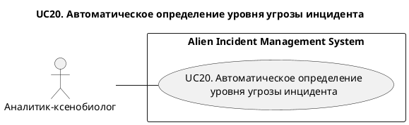

# UC20. Автоматическое определение уровня угрозы инцидента

```plantuml
@startuml
title UC20. Автоматическое определение уровня угрозы инцидента
left to right direction

actor "Аналитик-ксенобиолог" as Analyst

rectangle "Alien Incident Management System" {
  usecase "UC20. Автоматическое определение\nуровня угрозы инцидента" as UC20
}

Analyst -- UC20

@enduml
```
