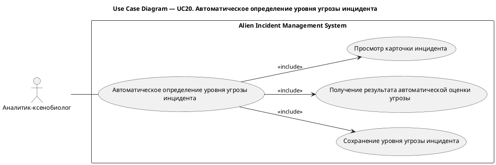
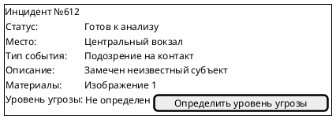
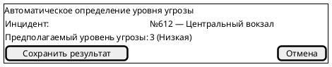

# UC20. Автоматическое определение уровня угрозы инцидента

## 1.Use-Case Name (Название прецедента)

UC20. Автоматическое определение уровня угрозы инцидента.

Связанные требования: 3.1.1.7.

## 2.Actors (Акторы)

Основное действующее лицо: Аналитик-ксенобиолог.

## 2. Brief Description (Краткое описание)

Аналитик-ксенобиолог открывает карточку инцидента, получает результат автоматического определения уровня угрозы и
сохраняет полученный уровень угрозы в инциденте.

## 3. Flow of Events (Последовательность событий)

### 3.1 Basic Flow (Главная последовательность)

1. Аналитик-ксенобиолог открывает карточку инцидента.
2. Аналитик инициирует автоматическое определение уровня угрозы.
3. Система определяет предполагаемый уровень угрозы на основе данных инцидента.
4. Система отображает полученный уровень угрозы.
5. Аналитик просматривает предложенный результат и инициирует его сохранение.
6. Система сохраняет уровень угрозы в инциденте.
7. Система фиксирует запись в истории изменений инцидента.
8. Система отображает карточку инцидента с сохраненным уровнем угрозы.

### 3.2 Alternative Flows (Альтернативные последовательности)

Не удалось определить уровень угрозы

1. Альтернативный поток начинается после шага 3 основного потока.
2. Система сообщает, что автоматическое определение уровня угрозы не дало результата.
3. Выполнение прецедента завершается без изменения данных инцидента.

Аналитик не принимает предложенный результат

1. Альтернативный поток начинается после шага 4 основного потока.
2. Аналитик отказывается от сохранения предложенного уровня угрозы.
3. Выполнение прецедента завершается без изменения данных инцидента.

## 4. Preconditions (Предусловия)

1. Пользователь авторизован в системе.
2. Пользователь обладает ролью Аналитик-ксенобиолог.
3. Инцидент не завершен.

## 5. Postconditions (Постусловия)

1. При сохранении результата инцидент содержит предложенный системой уровень угрозы.
2. Сохранение уровня угрозы зафиксировано в истории изменений инцидента.
3. Если результат не получен или не принят аналитиком, данные инцидента остаются без изменений.

## 6. Extension Points (Точки расширения)

Отсутствуют.

## 7. Use-case diagram (Диаграмма прецедента)

## 8. Interface example (Пример интерефейса)

