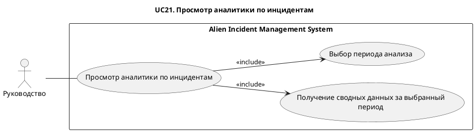

# UC21. Просмотр аналитики по инцидентам

## Диаграмма прецедента

```plantuml
@startuml
title UC21. Просмотр аналитики по инцидентам
left to right direction

actor "Руководство" as Management

rectangle "Alien Incident Management System" {

(Просмотр аналитики по инцидентам) as UC11

(Получение сводных данных за выбранный\nпериод) as UC115
(Выбор периода анализа) as UC111

}

Management -- UC11

UC11 --> UC111 : <<include>>
UC11 --> UC115 : <<include>>

@enduml
```
