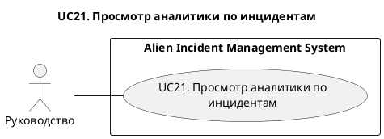

# UC21. Просмотр аналитики по инцидентам

```plantuml
@startuml
title UC21. Просмотр аналитики по инцидентам
left to right direction

actor "Руководство" as Management

rectangle "Alien Incident Management System" {
  usecase "UC21. Просмотр аналитики по\nинцидентам" as UC21
}

Management -- UC21

@enduml
```
