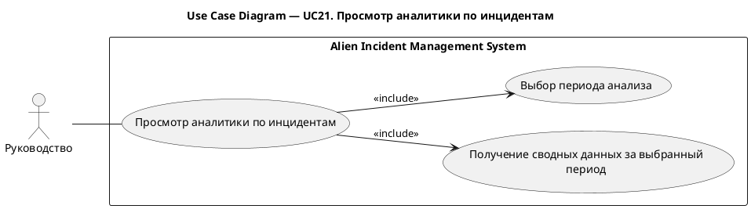
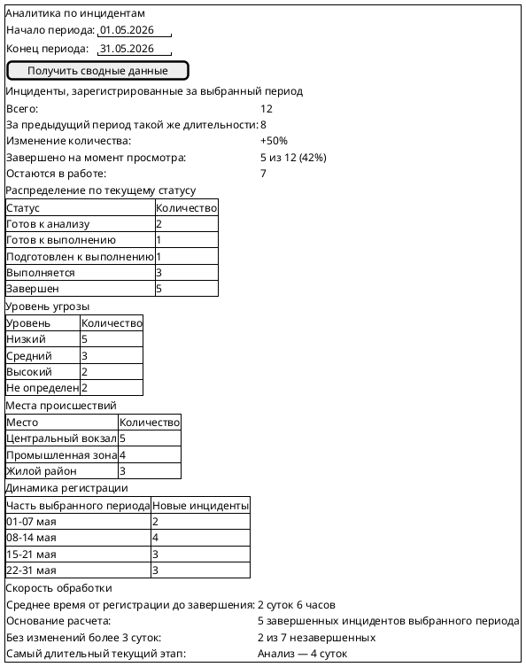
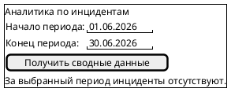

# UC21. Просмотр аналитики по инцидентам

## 1.Use-Case Name (Название прецедента)

UC21. Просмотр аналитики по инцидентам.

Связанные требования: 3.1.1.5.

## 2.Actors (Акторы)

Основное действующее лицо: Руководство.

## 2. Brief Description (Краткое описание)

Руководство выбирает период анализа и получает сводные данные по инцидентам за этот период для оценки работы с
инцидентами.

## 3. Flow of Events (Последовательность событий)

### 3.1 Basic Flow (Главная последовательность)

1. Представитель руководства открывает аналитику по инцидентам.
2. Пользователь указывает начало и конец периода анализа.
3. Пользователь запрашивает сводные данные за выбранный период.
4. Система проверяет корректность указанного периода.
5. Система формирует и отображает сводные данные по инцидентам за выбранный период.
6. Пользователь просматривает полученные сведения.

### 3.2 Alternative Flows (Альтернативные последовательности)

Указан некорректный период

1. Альтернативный поток начинается после шага 4 основного потока.
2. Система обнаруживает ошибки заполнения периода и сообщает о них пользователю.
3. Пользователь исправляет период анализа.
4. Выполнение возвращается к шагу 3 основной последовательности.

За выбранный период нет инцидентов

1. Альтернативный поток начинается на шаге 5 основного потока.
2. Система сообщает, что за выбранный период инциденты отсутствуют.
3. Пользователь просматривает результат. Прецедент завершается.

## 4. Preconditions (Предусловия)

1. Пользователь авторизован в системе.
2. Пользователь является представителем руководства организации.

## 5. Postconditions (Постусловия)

Отсутствуют.

## 6. Extension Points (Точки расширения)

Отсутствуют.

## 7. Use-case diagram (Диаграмма прецедента)

## 8. Interface example (Пример интерефейса)

