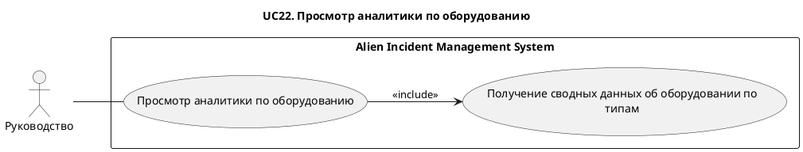

# UC22. Просмотр аналитики по оборудованию

## Диаграмма прецедента

```plantuml
@startuml
title UC22. Просмотр аналитики по оборудованию
left to right direction

actor "Руководство" as Management

rectangle "Alien Incident Management System" {

(Просмотр аналитики по оборудованию) as UC11

(Получение сводных данных об оборудовании по\nтипам) as UC114

}

Management -- UC11

UC11 --> UC114 : <<include>>

@enduml
```
