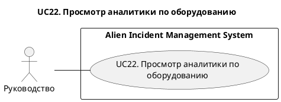

# UC22. Просмотр аналитики по оборудованию

```plantuml
@startuml
title UC22. Просмотр аналитики по оборудованию
left to right direction

actor "Руководство" as Management

rectangle "Alien Incident Management System" {
  usecase "UC22. Просмотр аналитики по\nоборудованию" as UC22
}

Management -- UC22

@enduml
```
