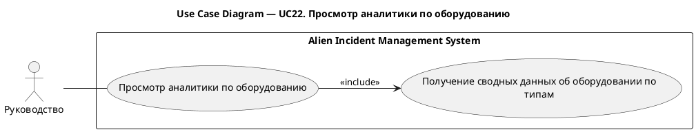
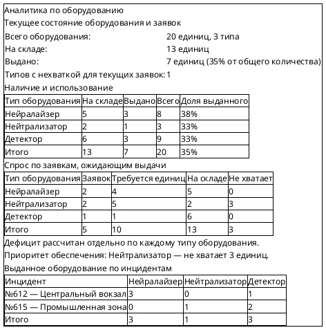
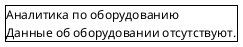

# UC22. Просмотр аналитики по оборудованию

## 1.Use-Case Name (Название прецедента)

UC22. Просмотр аналитики по оборудованию.

Связанные требования: 3.1.3.4.

## 2.Actors (Акторы)

Основное действующее лицо: Руководство.

## 2. Brief Description (Краткое описание)

Руководство обращается к аналитике по оборудованию и получает сводные данные об оборудовании разных типов для оценки
обеспеченности организации ресурсами.

## 3. Flow of Events (Последовательность событий)

### 3.1 Basic Flow (Главная последовательность)

1. Представитель руководства открывает аналитику по оборудованию.
2. Система формирует и отображает сводные данные об оборудовании разных типов.
3. Пользователь просматривает сведения о количестве оборудования по типам.

### 3.2 Alternative Flows (Альтернативные последовательности)

Данные об оборудовании отсутствуют

1. Альтернативный поток начинается на шаге 2 основного потока.
2. Система сообщает об отсутствии данных об оборудовании.
3. Пользователь просматривает результат. Прецедент завершается.

## 4. Preconditions (Предусловия)

1. Пользователь авторизован в системе.
2. Пользователь является представителем руководства организации.

## 5. Postconditions (Постусловия)

Отсутствуют.

## 6. Extension Points (Точки расширения)

Отсутствуют.

## 7. Use-case diagram (Диаграмма прецедента)

## 8. Interface example (Пример интерефейса)

