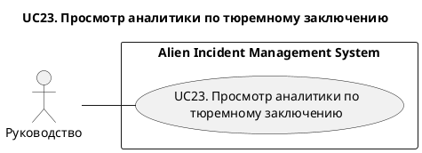

# UC23. Просмотр аналитики по тюремному заключению

```plantuml
@startuml
title UC23. Просмотр аналитики по тюремному заключению
left to right direction

actor "Руководство" as Management

rectangle "Alien Incident Management System" {
  usecase "UC23. Просмотр аналитики по\nтюремному заключению" as UC23
}

Management -- UC23

@enduml
```
